# AI 编程可闭环协作 · 全五卷合并版（公众平台粘贴版）

> **2026-06-02** · 系列合并 **v1.0.1** · 卷一～卷五定稿合并（**不替代** 单卷发表稿；含全书测评 P0/P1 修订）  
> **系列文稿**：[github.com/Cyning12/ai-coding-closed-loop-articles](https://github.com/Cyning12/ai-coding-closed-loop-articles)  
> **单卷发表**：卷一 [2675471](https://cloud.tencent.com/developer/article/2675471) · 卷二 [2676250](https://cloud.tencent.com/developer/article/2676250) · 卷三 [2678669](https://cloud.tencent.com/developer/article/2678669) · 卷四 [2680278](https://cloud.tencent.com/developer/article/2680278) · 卷五见仓内 `ARTICLE_*_vol5_v1.0.0_zh.md`

> **阅读建议**：全书约五篇连载之和；新项目从卷一 §6 起步，存量项目可直接跳卷五 §25 阶段 0（仍建议先 skim 卷一～三要点）。

---

> ## **全书目录（卷一～卷五）**


| 卷 | 节 | 标题 |
| --- | --- | --- |
| **卷一** | — | 摘要 |
| **卷一** | 0 | 缘起：个人约束与团队经验 |
| **卷一** | 1 | 为什么「会写代码」不等于「能交付」 |
| **卷一** | 2 | 两条轨：结构（图谱）与过程（协作流程） |
| **卷一** | 3 | 一轮交付怎样算「做完」：意图、成果、验收 |
| **卷一** | 4 | 与 TDD、Code Review、DevOps 的关系 |
| **卷一** | 5 | 适合谁、不适合谁 |
| **卷一** | 6 | 最小起步（给想试的读者） |
| **卷一** | 7 | 结语 |
| **卷二** | — | 摘要 |
| **卷二** | **8** | 技术图谱是什么：流程图、依赖与契约 |
| **卷二** | 8.0 | 与卷一的衔接 |
| **卷二** | 8.1 | 仓库里的技术图谱：先认「有哪些文件」 |
| **卷二** | 8.2 | 第一份图谱从哪来？（新项目 vs 老项目） |
| **卷二** | 8.3 | 怎样选「第一条核心链路」画图 |
| **卷二** | 8.4 | 「子图」一词：分册文档 vs 查询裁切 |
| **卷二** | 8.5 | 与架构图、C4、ADR 的分工 |
| **卷二** | 8.6 | 存量仓库：图谱不求全仓 |
| **卷二** | **9** | Agent 默认怎么读图：对照与验收 |
| **卷二** | 9.2 | 三种读法（通俗对照） |
| **卷二** | 9.4 | 收到任务：该不该读图谱？ |
| **卷二** | 9.5 | 图谱与 CI：门禁在流程里干什么 |
| **卷二** | 9.6 | （进阶）按题打包 |
| **卷二** | **10** | 结语 |
| **卷三** | — | 摘要 |
| **卷三** | **11** | 任务单最少写什么 |
| **卷三** | **12** | 审查与签收 |
| **卷三** | **13** | SDD 阶段流 |
| **卷三** | **14** | 半自动协作 |
| **卷三** | **15** | 存量 / 无 CI 降级 |
| **卷三** | **16** | 结语 |
| **卷四** | — | 摘要 |
| **卷四** | **17** | 一轮专题交付：从 SPEC 到归档 |
| **卷四** | **18** | 闭环后：经验卡片与跨轮回顾摘要 |
| **卷四** | **19** | 与「只会 Prompt」的工具链如何叠加 |
| **卷四** | **20** | 结语 |
| **卷五** | — | 摘要 |
| **卷五** | **21** | 存量案例：后端横切改动的一周 |
| **卷五** | **22** | 存量案例：前端 BFF + 契约类需求 |
| **卷五** | **23** | 常见误区 FAQ |
| **卷五** | **24** | 诚实边界：不能外推成什么 |
| **卷五** | **25** | 存量项目渐进落地 |
| **卷五** | **26** | 结语（系列收束） |


> ## **配图索引（Mermaid · 备档 PNG 见 `assets/figures/`）**


| 图 | 节 | 说明 |
| --- | --- | --- |
| `多模块API` | 卷一 §2.1 · 卷二 §8.0 | 见 `assets/figures/` 对应 PNG |
| `阶段骨架` | 卷一 §2.2 | 见 `assets/figures/` 对应 PNG |
| `总结` | 卷一 §7 | 见 `assets/figures/` 对应 PNG |
| `读图决策` | 卷二 §9.4 | 见 `assets/figures/` 对应 PNG |
| `可追责三问` | 卷三 §12.8 | 见 `assets/figures/` 对应 PNG |
| `可追责包` | 卷三 §12.9 | 见 `assets/figures/` 对应 PNG |
| `SDD阶段流` | 卷三 §13.2 | 见 `assets/figures/` 对应 PNG |
| `签收温层` | 卷三 §13.7 | 见 `assets/figures/` 对应 PNG |
| `一任务一PR` | 卷三 §14.7 | 见 `assets/figures/` 对应 PNG |
| `冷温热层` | 卷三 §14.8 | 见 `assets/figures/` 对应 PNG |
| `卷三结语` | 卷三 §16 | 见 `assets/figures/` 对应 PNG |
| `专题交付流水线` | 卷四 §17.3 | 见 `assets/figures/` 对应 PNG |
| `双仓串行PR` | 卷五 §22.3 | 见 `assets/figures/` 对应 PNG |
| `存量四阶段` | 卷五 §25.2 | 见 `assets/figures/` 对应 PNG |
| `冷温热协作记忆` | 卷五 §23.1 | 见 `assets/figures/` 对应 PNG |


---


---

> # **卷一 · 怎样才算「做完」——给 Agent 结构，给团队过程**

> release **v1.0.1** · https://cloud.tencent.com/developer/article/2675471

---

> ## **摘要**

AI 写代码的**交付质量**，往往不仅取决于模型，更取决于 **上下文是否够用**、**交付是否验得动**。  
本文介绍一套在真实项目里跑过的做法：**用技术图谱回答「改哪里、会影响谁」**，**用协作流程（Harness 类任务单流程）回答「谁来做、何时能合并」**——二者叠放，才能把一轮需求做成 **可闭环的交付**（有意图、有成果、有验收），而不是聊完即散。

---

> ## **0. 缘起：个人约束与团队经验**

这套方法**不是**从「企业治理办公室」起意，而是两条线叠在一起：

**一条线：当下的个人约束**

> **个人 AI Coding 使用者，预算有限，必须在有限资源里把价值放到最大。**

日常主力是 **Cursor Pro**，实现阶段多用 **Auto 模式**——往往**不能**随时指定最强、最贵的模型；Auto 还会**在不同模型之间切换**。不能赌「这一次一定是顶配模型」，而要让**不同档位的模型**，在同一套框架里，尽量产出**可预期、可验收**的结果。

**另一条线：之前在团队里形成的习惯**

在团队里做过需求拆分、Code Review、合并前 CI、书面留痕——知道 **「聊完了」和「交差了」不是一回事**。回到个人项目后，没有现成的同事帮你兜底，这些习惯就化成：**任务单、审查签收、测试与流水线**——也就是后文说的 **协作流程（Harness）** 一侧；不是大厂专属流程，而是**把团队里管用的做法，缩成一个人也能执行的最小集**。

两条线合在一起，探索方向变成：

| 痛点（个人 + 延续团队习惯） | 方法上的回应（卷一总览） |
| --- | --- |
| 上下文贵、不能整仓灌 Prompt | **技术图谱 + 子图**：先给「地图」，少读无关文件 |
| Auto 换模型、输出风格飘 | **任务单 + 协作流程**：意图 / 成果 / 验收写死，不完全依赖模型脾气 |
| 一个人也要能说清「做完了」 | **闭环交付**：签收 + CI，而不是「感觉差不多了」 |
| 同类坑下次重讲一遍 | **（可选）经验卡片 / Skill**：闭环后蒸馏，不替代图谱与任务单 |

后面各卷是在真实仓库里的**落地、对照实验与归纳**；卷一先把「图谱 + 过程」为何叠放讲清。若你是 **Pro + Auto、预算敏感** 的独立开发者，又曾在团队里吃过「没留痕、没验收」的亏，可以把本文当作**个人约束 + 团队经验压缩版**的工程化总结。

日常主力仍是 **Cursor Pro（Auto）**；也曾用过 **Kimi Code**，近期在 **Claude Code** 上用同一套任务单试了几项任务，协作流程可复用。**工具会变，意图 / 成果 / 验收不变**——本文不绑某一品牌。

---

> ## **1. 为什么「会写代码」不等于「能交付」**

很多团队已经习惯：自然语言描述需求 → Agent 改文件 → 人眼看 diff → 合并。  
问题在于：

| 常见痛点 | 根因（简化） |
| --- | --- |
| 改 A 漏 B，联调才发现 | Agent **不知道系统结构** 与依赖 |
| 同一需求反复解释 | **没有可复用的规格与任务依据**（SPEC、配置、任务单） |
| PR 能合但心里没底 | **缺少书面签收与自动化验收** |
| 对话很长、账单很高 | **整仓塞给模型**，无关文件太多 |

TDD、Code Review、CI 并没有过时；AI 加入后，缺的是 **面向 Agent 的结构化上下文** 和 **面向人的协作纪律**。  
这就是 **AI Coding 治理** 要补的块：不是再发明一套敏捷，而是让 **告知 · 约束 · 验证** 在 AI 场景下可执行（业内也常对应 Inform / Constrain / Verify）。

---

> ## **2. 两条轨：结构（图谱）与过程（协作流程）**

> ### **2.1 技术图谱：让 Agent「先看地图再动手」**

**技术图谱**（流程图 + 模块关系 + 契约清单）回答：

- 系统长什么样？
- 这次改动应从哪个入口看起？
- 可能影响哪些模块、接口、测试？

**示例：多模块 API 一条主链路（左→右为请求方向；可另存为 `.md` 改模块名）**

<!-- 图 1：2.1 技术图谱：让 Agent「先看地图再动手」 -->
<!-- 图 1：2.1 技术图谱：让 Agent「先看地图再动手」 -->
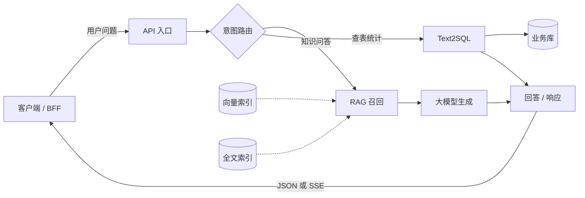

**怎么读这张图**

| 层次 | 是什么 | 本示例里对应什么 |
| --- | --- | --- |
| **主图** | 一张「鸟瞰」：模块怎么连、请求从哪进、从哪出 | **就是上图**——方块如 `RAG 召回`、`Text2SQL` 是**入口名**，不是实现细节 |
| **子图** | 单独一篇 `.md`，只展开主图里**某一个方块**内部的步骤、依赖、测试锚点 | 主图不画满细节；在子图标题或图注里写「详见 `10_flow_rag.md`」即可（文件名按你仓库约定） |

流向：**用户在左** → API 入口 → 意图路由分叉 → 各分支处理 → 右侧 **回答 / 响应** 回传客户端（回包节点不要误标成第二个「对话 API」）。

**Agent 怎么用它（举例）**

> 任务：**改 RAG 召回策略**（例如阈值、融合排序、降级路径）。  
> 做法：在主图上定位到 **`RAG 召回`** 这一格 → **只打开** 对应的子图（如 `10_flow_rag.md`）→ 在子图里做**关联性分析**：会动哪些函数、是否牵连向量/全文检索、要补哪些单测。  
> **不必**把主图 + 所有子图 + 整仓目录一次性塞进 Prompt。

可概括为：**主图定入口与边界，子图定这次改动的纵深**；从「要改的那一格」钻进去，比从仓库根目录乱翻更快，也更不容易漏关联。卷二会写子图怎么拆、怎么链回主图。

实践要点（与具体工具无关）：

- 图谱 **由人维护、由脚本导出**（若暂无导出脚本，**手动维护一张接口清单表格也可**，后续再自动化），避免手改一份 JSON 和 Mermaid 两套不一致；**初期可先画一张主图 + 一条子图**，再逐步补全；
- 关键改动可用 **对照验证**（例如影响面命中率、上下文 token；具体做法见卷二，此处仅提示可量化验证）评估「读图方式」是否值得推广。

对读者而言：图谱解决的是 **「别漂」**——减少幻觉和漏改，不替代写测试。初期图谱不必完美，**能从入口文件画出第一层依赖即可**。

> ### **2.2 Harness（协作流程 / 任务单流程）：让协作「可签收、可合并」**

**Harness**（下文也称 **协作流程** 或 **任务单流程**）指一套 **工程化协作外壳**（名称可自定），核心是 **SDD（规格驱动开发）式的阶段流程** 与任务单纪律。

**示例：阶段骨架（人 / Agent / CI 分工细节见卷三）**

<!-- 图 2：2.2 Harness（协作流程 / 任务单流程）：让协作「可签收、可合并」 -->
<!-- 图 2：2.2 Harness（协作流程 / 任务单流程）：让协作「可签收、可合并」 -->
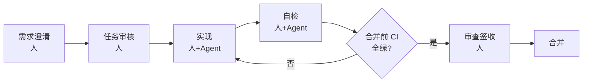

文字版（与上图一致；**冷静复检**可在「审查签收」与「合并」之间插入，卷三展开）：

```text
需求澄清 → 任务审核 → 实现 → 自检 → [合并前 CI 全绿?] →（否，回到实现）→ 审查签收 → 合并
```

各阶段「谁来做」的细化见 **卷三**；本卷先给骨架。

与日常研发概念的对应：

| 大家熟悉的事 | 协作流程里强调什么 |
| --- | --- |
| 需求 / SPEC | 写清验收与非范围 |
| Code Review | **书面审查** 落盘，终审 = 可以结束任务 |
| CI | **合并前必绿**，不是「聊过了就算」 |
| TDD / 单测 | 关键路径 **先能失败再改实现**（策略写在任务单里） |

协作流程解决的是 **「别乱合并」**——过程可追溯，不替代技术图谱。

> ### **2.3 叠放：缺一条都会「差点意思」**

| 只有过程 | 只有图谱 |
| --- | --- |
| 知道怎么审、怎么测 | 知道改哪里、影响谁 |
| 仍可能改错范围、漏依赖 | 仍可能没签收、没 CI 就合并 |

**推荐叠放**：同一轮需求里，任务单同时引用 **规格 / 图谱入口 / 测试策略**；审查签收前对照 **审查记录 + CI +（如有）实验结论**。

---

> ## **3. 一轮交付怎样算「做完」：意图、成果、验收**

对大众读者，一轮 **可闭环的交付**（也可称 **专题 / 一轮交付**）至少包含：

| 要素 | 一句话 |
| --- | --- |
| **意图** | 要达成什么、不做什么（需求或 SPEC + 边界） |
| **成果** | 可合并的代码、配置、文档、规则变更 |
| **验收** | 测试 / CI 通过 + 审查签收 + 关键结论可追溯 |

**示例：小需求如何填三要素（给登录加图片验证码）**

| 要素 | 示例内容 |
| --- | --- |
| **意图** | 支持图片验证码防暴力破解；不影响已有短信登录 |
| **成果** | `login` 增加校验；新增 `captcha`；配置 `captcha_ttl=300`；`api.yaml` 更新 |
| **验收** | 单测 `TestLoginWithCaptcha` 通过；错误验证码 curl 返回 401；CI 全绿；审查签收 |

研发功能与基础设施改造 **同一套骨架**：差别只在「意图」来自产品需求还是技术专题，验收证据里有没有额外的对照实验报告。

**可选第四步**：闭环后把教训蒸馏成 **半页以内的经验卡片** 或团队 Skill，服务下一同类任务——不替代图谱，也不替代任务单。例如：「缓存失效坑：改 A 必须清 B 缓存」——**一句话教训即可**。

---

> ## **4. 与 TDD、Code Review、DevOps 的关系**

- **TDD**：仍负责「行为对不对」；协作流程负责「这次改动有没有测试策略、敢不敢合并」。  
- **Code Review**：协作流程把「聊过」变成 **可检索的审查记录**；图谱让 Reviewer 更快看影响面。  
- **CI/CD**：自动化验收的硬背压；Agent 自检不能代替流水线。  
- **Prompt / Rules / Skills**：偏 **个人与项目习惯**；协作流程 + 图谱偏 **团队可审计的交付**。可叠加，避免两套冲突流程。

---

> ## **5. 适合谁、不适合谁**

**更适合**

- 多模块后端 / 全栈，依赖关系复杂；
- 已上 PR + CI，希望 AI 改动 **可审计**；
- 愿意维护 **一份活图谱**（不必一步到位，可从一条核心链路开始）。

**暂不强调**

- 一次性脚本、单文件作业；
- 没有 CI、也没有书面 Review 习惯的小团队（应先补自动化验收，再谈 AI 规模化）。

**诚实边界**（基于当前实践范围）

- 方法在 **已建模的图谱 + 有限范围对照评测** 上验证过，**不能** 直接宣称「任意仓库、任意语言开箱即用」；
- 换模型、换仓库应 **重新建立对照测试与评测记录**，再谈指标；
- 图谱与流程 **降低风险、提高可预测性**，不保证零事故。

**换句话说**：若你还没有为仓库画过 **第一张主图**、也没有跑通过一次完整的 **任务单 → 合并前检查 → 书面签收**，本文的方法对你来说仍是 **纸上谈兵**——请 **先从一条链路** 试通，不要试图在一两周内给全仓铺满图谱与流程。

若你**尚无 CI**，可先定合并前必须手动跑的命令（如 `npm test && npm run build`）作为**手动门禁**，写在任务单里，再逐步补流水线。

---

> ## **6. 最小起步（给想试的读者）**

1. **选一条核心链路**（例如问答 API、登录、入库）画进技术图谱，接入导出校验（PR 改图则 CI 提醒）。  
2. **写第一份任务单**：复制下面模板，改标题与清单即可。  
3. **定合并前必跑命令**（lint / test / build），写进仓库说明。  
4. **跑通一轮**：需求 → 审核 → 实现 → 自检 → **CI 全绿** → 审查签收 → 合并。  
5. **（可选）** 闭环后写一张经验卡片：同类需求下次少踩坑；可放在仓库 `docs/experience/` 下，或你的个人笔记里。

> **提示**：实际执行中，你可能遇到 **图谱/契约检查 CI 变红**、**任务单被拒开工**、**独立复检打回** 等分支。本文先讲 **理想路径**；恢复策略与真实案例见 **卷三**（签收纪律）与 **卷四**（专题收尾 · 含契约/锚点 CI 主失败分支）。

**任务单模板示例（可复制）**

```markdown
## 任务单：增加验证码登录

### 验收清单
- [ ] 正确验证码能登录
- [ ] 错误验证码返回 401
- [ ] 验证码 5 分钟过期

### 失败路径
- [ ] 验证码为空 → 400
- [ ] 验证码已过期 → 400

### 测试策略
- 必测：`TestLoginWithCaptcha_Success` / `TestLoginWithCaptcha_Wrong`
- 不适用：性能压测（本期量小）

### 图谱入口
- 子图：`10_flow_login.md`（示例路径，按你仓库改）

### CI 门禁（自动检查，不通过则阻塞合并）
- [ ] lint 通过
- [ ] 单测通过
- [ ] 图谱/契约一致性校验（若仓库已配置）

### 合并前命令
- `npm run lint && npm test && npm run build`
```

---

> ## **7. 结语**

> ### **卷一总览：图谱 + 协作流程叠放**

<!-- 图 3：卷一总览：图谱 + 协作流程叠放 -->
<!-- 图 3：卷一总览：图谱 + 协作流程叠放 -->
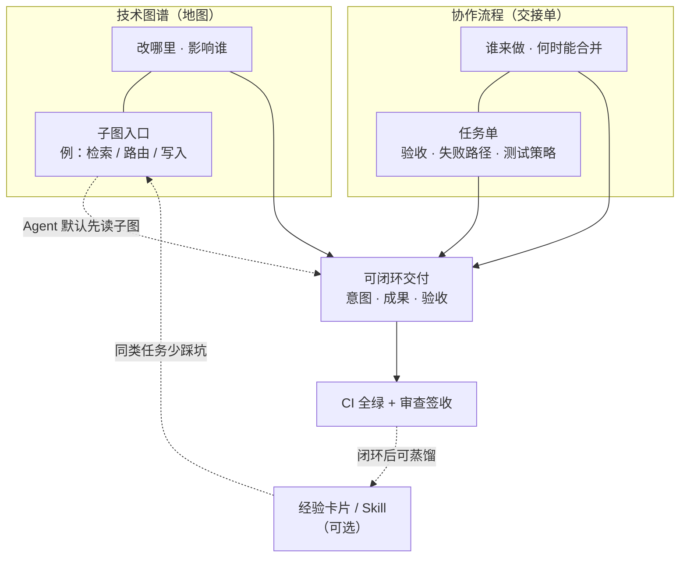

**读图要点**：图谱给 **空间结构**（含子图，省上下文）；协作流程给 **时间与责任**（任务单 + CI 闸）；二者在「可闭环交付」汇合，最终以 **机器验收 + 人签收** 落锤。可选经验沉淀反哺下一轮子图阅读，**不替代** 图谱与 Harness。


AI Coding 的竞争力，越来越多来自 **「上下文工程 + 工程纪律」**，而不是多背几条 Prompt。  
**图谱** 让 Agent 像熟路司机一样看导航；**协作流程** 让团队像有交接单的工班一样交棒。  
两者叠好，一轮需求才能从「聊完了」变成 **「做完了，且说得清依据」**——这才是 AI 时代研发治理该瞄准的状态。

---

---

> # **卷二 · 技术图谱——让 Agent 先看地图再动手**

> release **v0.8.2** · https://cloud.tencent.com/developer/article/2676250

---

> ## **摘要**

若你还没读过 **卷一：怎样才算「做完」**，建议先看——那里讲清了 **图谱 + 协作流程** 如何叠放，以及「意图 / 成果 / 验收」怎样算一轮交付。

卷一也点过：**技术图谱** 负责回答 Agent「改哪里、会影响谁」。**本卷只展开图谱这一轨**：先 **认得仓库里有哪些图谱文件**（流程图、表结构说明、入口清单、机器总图等），再讲 **第一份图从哪来**（新项目 vs 老项目）、**流程图为何有 md / ai.md / json 三轨**、**Agent 默认怎么读**（查询子图 + 清单便签，而不是整仓灌 Mermaid）、**图谱相关 CI 门禁**在合并流程中的作用，以及 **怎样验证读图方式是否值得坚持**。协作流程与合并签收在 **卷三**；有地图没签收，照样不敢合并。

---

> ## **8. 技术图谱是什么：流程图、依赖与契约**

卷一讲了主图、子图 **怎么用**。本节先回答三件事：**仓库里有哪些图谱文件、各自干什么** → **第一份图从哪来** → **Agent 默认怎么读**。不必先背文件名，下面命名只是笔者实践中使用示例，并非规范。

> ### **8.0 与卷一的衔接**

卷一 §2.1 的 **主图 + 子图** 是本卷锚点。若你还没读过，先扫一眼卷一里的多模块 API 主链路示意，再读下文。

**公众版主图（与卷一同构，可另存改模块名）**

<!-- 图 1：8.0 与卷一的衔接 -->
<!-- 图 1：8.0 与卷一的衔接 -->


> ### **8.1 仓库里的技术图谱：先认「有哪些文件」**

先不要想抽象方法论。技术图谱在工程上就是：**仓库里的一个专用文件夹**（例如 `docs/_tech_graph/`，名字可自定），里面放 **「帮 Agent 改代码用的地图与清单」**——不是产品 PRD 全文，也不是替代 README。

下面用 **通俗名** 介绍。**下表文件名为笔者项目中的命名，并不唯一**——你的团队可以自定目录名与编号规则，只要团队内一致即可。

 #### 图谱夹里常见几类物件


| 通俗名            | 笔者项目中的文件名示例（不唯一）                    | 它到底是什么                                                             | 主要谁看               |
| -------------- | ----------------------------------- | ------------------------------------------------------------------ | ------------------ |
| **主流程图（人读）**   | `00_main.md`                        | **鸟瞰图**：用户请求从哪进、分几条业务大路                                            | 人（Review、讨论）       |
| **分册流程图（人读）**  | `10_flow_rag.md`                    | 主图上 **某一格**（如「RAG 召回」）展开成详细步骤                                      | 人                  |
| **流程图（导出用原稿）** | `00_main.ai.md`、`10_flow_rag.ai.md` | 与上 **同一套流程**，边、分支、**对应代码位置** 写得更规整，给脚本读                            | 人维护；脚本读            |
| **机器总图**       | `graph.json`                        | 把多篇「导出用原稿」**编译成一份总图**（节点、连线、代码锚点）；**不要手改这个文件**                     | Agent **查询**（见下）   |
| **表结构说明**      | `01_struct.md`                      | 数据库 **表/字段/关系**（常用类图表示）                                            | 改表、改向量维度时 **必翻**   |
| **入口清单**       | `_manifest.json`                    | **可从外部触发的功能入口索引**：API 项目常列路径与 handler；CLI/库/批处理可列命令、公开函数、模块入口与代码锚点 | 改路由、改入口、对照「从哪进代码」时 |
| **契约清单**（可选）   | `_contract_manifest.json`           | **跨服务约定**：如流式返回字段、错误码形状                                            | 改 BFF/前后端契约时       |
| **实现规约**       | `99_spec.md`                        | **环境变量、禁止编造、和代码一致的约束**                                             | 改配置、改关键路径前         |


**单独说清楚两个最容易懵的词：**

- **graph.json（机器总图）**  
不是让人逐字阅读的文档，而是 **「印刷好的大地图集」**：由 `*.ai.md` 经脚本 **导出** 得到。Agent 默认 **不会** 把整份 JSON 塞进对话（太大），而是 **按入口查一小段**——例如「从 RAG 这一节点往下 2 跳」（§8.4 叫 **查询子图**，§9 用 GPS 比喻）。  
**改图时**：改 `*.ai.md`（或先从 `*.md` 改起再同步），再重新导出；**不要** 直接改 `graph.json`。
- **01_struct（表结构说明）**  
就是 **「数据库地图」**：有哪些表、和业务流程怎么关联。  
**和 `graph.json` 不是一回事**；不能因为有了总图就删掉它。
- **入口清单 / 契约清单**（不同于机器总图）  
**机器总图** 描述 **流程与调用关系**；**入口清单** 描述 **有哪些对外的「门」**（不必是 HTTP）。可以想成：GPS 路网（总图） vs **公交站牌表**（入口清单） vs **路口规则**（契约清单）。

表结构、契约、机器总图可以 **第二步再补**。入门时先凑齐下面 **最小图谱夹** 即可开工。

 #### 最小图谱夹示例（笔者项目 · 3 个文件）

> 文件名 **并不唯一**；分册名 `10_flow_rag` 请换成你第一条核心链路（如登录、入库）。

| 文件（示例名） | 通俗名 | 第一步写什么 |
| --- | --- | --- |
| `00_main.md` | 主流程图（人读） | 一页鸟瞰：请求从哪进、分几条大路 |
| `10_flow_rag.md` | 分册流程图（人读） | 主图上 **一格** 展开（如 RAG 召回） |
| `_manifest.json` 或 **表格** | 入口清单 | 对外入口列表；无 JSON 时先用 Excel/表格 |

有导出脚本后，再补 `*.ai.md` 与 `graph.json`（§8.1 上表「流程原稿 / 机器总图」）。

 #### 三类「逻辑信息」（对上表，不必死记文件名）


| 逻辑类型      | 回答的问题             | 常见落在哪些文件                                   |
| --------- | ----------------- | ------------------------------------------ |
| **流程**    | 先走哪、再走哪、有哪些分支     | `*.md`、`*.ai.md`；Agent 查询 `graph.json` |
| **结构与依赖** | 改 A 会不会牵动表 B、模块 C | `01_struct.md` 等                       |
| **契约与验收** | 对外形状长什么样、测什么算过    | **入口清单**、契约清单、测试用例                         |


记一句即可：**机器总图** 主要管「流程怎么走」；**入口清单**、表结构说明仍要单独维护。

 #### 为何同一套流程图，会有 `.md`、`.ai.md`、`graph.json`？

只对 **流程图** 这三样容易觉得重复。可以记 **三轨**（不是三个互相无关的项目）：


| 轨            | 是什么               | 比喻                                            |
| ------------ | ----------------- | --------------------------------------------- |
| **人读轨**      | `*.md` 里的 Mermaid | 给人看的 **纸质地图**                                 |
| **维护 / 导出源** | `*.ai.md`         | 给「印刷机」（导出脚本）的 **制版稿**                         |
| **机器查询轨**    | `graph.json`      | 印好的 **可检索地图**；Agent 默认 **查检索版的一页**，不默认复印制版稿全文 |


```text
人改图（常从 .md 入手）→ 同步 .ai.md → 脚本导出 graph.json → Agent 按任务查其中一截（+ 入口清单等便签，见 §9）
```

**不是**「有 json 就可以删 md / ai.md」。**是**：**机器总图（json）** 来自 `.ai.md`；人若不读 md，仍要有人维护 **ai.md（或能自动生成它）**，否则总图会过期。

---

> ### **8.2 第一份图谱从哪来？（新项目 vs 老项目）**

读者常问：「我还没有图，第一张怎么画？」——**分新老项目，别一刀切。**

 #### 新项目（推荐）


| 步   | 做法                                                            |
| --- | ------------------------------------------------------------- |
| 1   | 产品或技术方案里 **先画一页 Mermaid / 白板**：一条核心链路（用户 → API → 关键模块 → 回包）   |
| 2   | 工程落盘：**主图** + **一个分册**（人读 `.md`；习惯名如 `00_main` + `10_flow_*`） |
| 3   | 补 **入口清单**（表格或 JSON 均可）和 **表结构说明**（可后补）                       |
| 4   | 有脚本后：人读 `.md` 定稿后 **同步 `*.ai.md`** → **导出机器总图 `graph.json`**，并在 PR 上跑检查 |


**白话**：新仓 **先有小地图，再写代码**；不必等「全系统架构完美」。

 #### 老项目 / 存量


| 情况                       | 第一份图怎么来                                |
| ------------------------ | -------------------------------------- |
| **有一点文档**（Wiki、旧架构图、接口表） | 文档定形状，**用代码入口与调用链核对**；文档当辅助，不当唯一依据     |
| **几乎没文档**                | **选一条能独立闭环的链路** → **从代码反推** 画主图 + 一篇子图 |
| **切忌**                   | 第一周铺全仓、所有历史模块一次画全                      |


**什么样的链路适合当「第一张」？**

- 有清晰 **HTTP / BFF 入口**（一个路由族即可）  
- 改完能用 **现有或刚补的少量单测** 验证  
- **先别选** 全局配置、横切中间件、多仓胶水

**反推怎么画（不写工具名也能做）**：从对外路由/handler 起笔 → 跟 2～3 层调用/表 → 主图 5～9 个方块 + 一篇子图。**第一版 70 分就够**；在真实 PR 里 **顺手改图 + 任务单验收** 迭代，不追求一次画准。

---

> ### **8.3 怎样选「第一条核心链路」画图**

（在 §8.2 选定「画哪条」之后，用本 checklist 落笔。）


| 适合当试点            | 尽量先别选          |
| ---------------- | -------------- |
| 高频、有真实调用         | 一年改一次的边角模块     |
| 有基本单测或能补最小测试     | 完全无测试、一改就恐     |
| 依赖面可控（约 3～7 个节点） | 十条链路同时开图       |
| PR 愿意顺手改图        | 「图归架构组、业务从不维护」 |


1. 写下链路名（例：「AI 问答」「登录」「入库」）。
2. 画 **主图** 一页：左进右出，分叉写清。
3. 选 **一个** 最常改的分支，拆 **分册子图** 一篇。
4. 任务单写 **图谱入口**：主图 + 子图路径。
5. 合并前跑通卷一 §6 的合并前命令（按栈改）。

---

> ### **8.4 「子图」一词：分册文档 vs 查询裁切**

「子图」在协作里有两层意思，**都对，别混**：


| 含义                 | 是什么                                               | 例子                                       |
| ------------------ | ------------------------------------------------- | ---------------------------------------- |
| **分册子图（写作）**       | 主图上一格展开的 **详细流程图文件**                              | `10_flow_rag.md` / `10_flow_rag.ai.md`   |
| **查询子图（Agent 默认）** | 从 `graph.json` 用「从某入口往下/往上几跳」**裁出来的一小块 JSON** | **不是** 把整份 `10_flow_rag.ai.md` 贴进 Prompt |


卷一说「打开 RAG 子图」多指 **分册**；**推荐 Agent 默认**用的是 **查询子图**（更省上下文，实验里称 **查询子图轨**，下文 §9.2）。

**不要整仓灌给 Agent**：整目录 + 整文件 `graph.json` + 所有 flow 全文 → 贵、噪声大、仍可能漏关联。


| 推荐                                   | 避免                   |
| ------------------------------------ | -------------------- |
| 任务单写明入口；**查询裁切** + 按需 **接口/契约清单** 切片 | 默认整包 Mermaid、整图 JSON |


**故事线（续卷一）**：改 RAG 召回策略 → 主图定位 `RAG 召回` → **查询子图**（或打开分册对照）→ 看契约/测试锚点 → 改代码。

---

> ### **8.5 与架构图、C4、ADR 的分工**


| 资产               | 典型用途        | 与技术图谱关系                          |
| ---------------- | ----------- | -------------------------------- |
| **架构分层图 / 部署图**（如 C4：从系统边界到容器、组件的分层画法） | 给人讲边界、运维 | 图谱引用即可，**不重复画一遍** |
| **ADR / 架构决策记录** | 记录「为什么这样设计」 | 任务单链 ADR；Agent 读图谱 + 必要时读 ADR 摘要 |
| **Wiki / 需求文档**  | 产品语义        | **薄层叠加**：图谱不写 PRD 全文，只写工程入口与依赖   |


**技术图谱**（本篇主题）：给 Agent **改代码时的导航与影响面**——入口、流程、入口清单、表结构等（见 §8.1）。与 Wiki、ADR **并存**：产品语义在 Wiki，设计理由在 ADR，**动实现时优先更新图谱**。

---

> ### **8.6 存量仓库：图谱不求全仓**


| 阶段    | 做什么                            |
| ----- | ------------------------------ |
| **0** | 一张主图 + 一条分册子图 + 一张接口/表清单（表格即可） |
| **1** | PR 触及该链路时 **顺手改图**             |
| **2** | 入口清单 + 导出脚本 + CI：防地图过期、防手改总图   |
| **3** | 对照验证读图方式（§9，进阶）                |


勿追求第一周全仓数字孪生；卷五将专讲 **存量渐进落地**。

---

> ## **9. Agent 默认怎么读图：对照与验收**

> ### **9.1 为什么要谈「读图方式」**

画了图 ≠ Agent 真会用。团队需要约定：**默认给模型看什么**——否则有人整仓贴 Mermaid，有人只给目录树，结果不可比、也难验收。

> ### **9.2 三种读法（通俗对照）**

把仓库里的总地图想成 **一本厚地图册**（导出后的 `graph.json`，**不默认背整本**）：


| 读法                      | 好比                       | 说明                                                            |
| ----------------------- | ------------------------ | ------------------------------------------------------------- |
| **整包 Mermaid**          | 把整本图册复印进 Prompt          | token 极大；**已不再作为默认方式**                                           |
| **精选 Markdown 原文**      | 复印与本题相关的两三章说明书           | 实验 **对照臂**：配对 `*.ai.md` + `*.md` 片段；人读友好，作 Agent **主载荷** 往往更贵 |
| **查询子图 + 便签**（**推荐默认**） | **GPS 导航** + **站牌/警示便签** | 只裁与入口相关的一截路网 + 清单与影响提示                                        |


笔者曾在一处 **后端 API 示例项目** 上做过 **读法对照**（不是功能测试全集）：在 **已建图谱的单仓库** 里，用 **3 道固定任务** 比较不同「喂给模型的地图材料」。在 **该有限题集** 上观察到：**查询子图轨** 静态上下文明显小于「精选 Markdown 原文」；部分题 **影响面列得更全**（**未给出具体 token 数字，勿外推**）。据此在笔者项目中约定：**Agent 改图时默认查询子图**，而不是默认灌整段双轨 Markdown——你的团队应 **自建题集并重测** 后再固化规则。

**示例题集（笔者项目 · 3 题，仅说明「比的是什么」）**

> **以下三题仅为笔者仓库的读法对照样例，不是你的团队必须照抄的题目。** 请从 **真实 PR** 抽取 5～10 道自建题集。


| #   | 任务类型（白话）                            | 对照焦点             |
| --- | ----------------------------------- | ---------------- |
| 1   | 改 **RAG / 嵌入与运行环境** 相关配置            | 入口与环境变量、召回链路影响面  |
| 2   | 改 **统一问答的流式返回**（如 SSE / 事件形态）       | 契约与跨端字段、接口链路子图   |
| 3   | 改 **入库 / 管理类写入链路**（如 ingest、同步 RPC） | 流程子图 + 表/元数据是否列全 |


题集目的：**比较读图方式**（整包 / 精选 Markdown / GPS+便签），**不是**证明三道题做完就等于全仓合格。正式团队宜从 **真实 PR 抽出 5～10 道** 作自己的题集；上文三题 **不能** 代表 CLI、纯前端或其它业务形态。

**维护仍靠人**：`.md` / `.ai.md` 照旧更新 → 导出 → 再查询；**升级的是读法，不是取消图源**。

**日常 vs 进阶**：上面「GPS + 便签」指 Agent **每次按任务现场查询**——**日常开发不需要「按题打包」**。若要做 **读法对照实验**、或 **冻结某一任务的上下文** 以便复跑，才把 §9.2 题集里某一题所需的查询子图 + 站牌/警示便签 **预先收成一袋 Prompt 材料**（§9.6）。

> ### **9.3 GPS 与便签：谁是谁**


| 比喻             | 对应什么                                                                    |
| -------------- | ----------------------------------------------------------------------- |
| **GPS 导航**     | 从总图 **按入口查询** 裁出的 **子图 JSON**（含节点、边、代码锚点）                               |
| **站牌便签**       | **入口清单里与本题相关的几条**（如 URL/handler，或命令、函数锚点）                               |
| **施工警示便签**     | **影响面提示**（「这类改动通常还动哪些文件」——进阶实验里加强）                                      |
| **路口规则便签**（可选） | **契约切片**（流式 API、字段约束等）                                                  |
| **整章说明书**      | 精选 `*.ai.md` + `*.md` 全文——留给 **对照或人读**，不作默认主载荷                          |
| **表结构 + 规约手册** | **表结构说明、实现规约**（笔者项目中如 `01_struct.md`、`99_spec.md`）——改表、改 env 时 **另外打开**；下文决策图里简写为 **「表结构+规约」** |


> ### **9.4 收到任务：该不该读图谱？**

很多人问：「图谱夹文件不少，是不是每次对话都要通读？」——**不必。** 团队应约定 **读图决策**，避免 Agent 要么整仓灌图、要么完全不看。

下面用与 §9.3 **同一套比喻**（GPS / 便签 / 表结构+规约）；文件名仅为笔者项目示例。

**怎么读这张图**：**菱形** = 判断（是/否）；**矩形** = 动作（去读什么、去做什么）；**从左到右**沿箭头阅读。

<!-- 图 2：9.4 收到任务：该不该读图谱？ -->
<!-- 图 2：9.4 收到任务：该不该读图谱？ -->
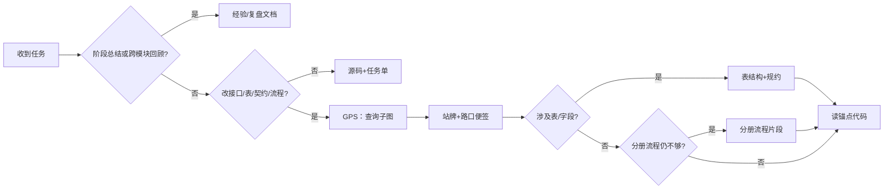


**怎么读这张图：**


| 分支                  | 含义                                                                                          |
| ------------------- | ------------------------------------------------------------------------------------------- |
| **回顾支路**（第一个菱形选「是」） | 打开 **经验或复盘类文档**（若有）；用于理解背景，**不能**代替改代码时的 GPS+便签。 |
| **不必开图谱**（第二个菱形选「否」） | **源码 + 任务单** 往往够用，不必为了「有图谱」而开图谱夹。 |
| **改代码主链**（向右延伸） | 默认 **GPS（查询子图）→ 站牌/路口便签**；动表或元数据再开 **表结构说明与实现规约**；流程细节仍不够才看 **分册流程图片段**；最后落到 **锚点代码**——图是导航，不是替代实现。 |


**推荐读序（改代码时）**：

```text
GPS 查询子图 → 站牌/路口规则便签 → 按需 表结构+规约 → 不足时 分册流程图片段 → 锚点代码
```

**两种常见误解：**

1. **「不改业务代码就用不到图谱」**——对 **Agent 是否开图** 大体成立；但 **提 PR 合并时，CI 仍会校验图谱是否与代码一致**（见 §9.5），与 Agent 当轮读没读无关。
2. **「任务很小也要通读图谱夹」**——若任务单已写明「改某表的某字段」，即使改动行数少，也应打开 **表结构说明**（及必要时 **实现规约**）对照，而不是跳过图谱。

卷四将展开 **经验文档库** 与图谱的分工；本卷只强调：**默认读图姿势是 GPS+便签，不是每次复印整本图册。**

---

> ### **9.5 图谱与 CI：门禁在流程里干什么**

卷一 §6 讲过 **合并前必绿**：单测、lint、构建等。技术图谱再补一层——**文档与代码别悄悄分叉**。它和「Agent 这一轮 Prompt 里带了什么」是 **两条线**：

```text
人/Agent 改代码 + 顺手改图（.md / .ai.md）
        ↓
    导出机器总图（若已有脚本）
        ↓
    提 PR → CI 自动跑图谱相关检查 + 常规测试
        ↓
    全绿 → Review → 合并
```

**CI 在这里的角色**：不是替 Agent 读图，而是 **在合并前拦住「图已过期」**——相当于地图出版社的 **校对车间**。


| 常见检查（按团队裁剪）      | 在拦什么                                          |
| ---------------- | --------------------------------------------- |
| **入口清单 vs 实现**   | 新增/删改的对外入口，清单里有没有登记、路径是否对得上                   |
| **导出总图 vs 流程原稿** | 机器总图是否与 `.ai.md` 同步（禁止只改总图、不改原稿）              |
| **文档漂移**         | 代码里出现的表名、关键环境变量等，图谱文档里是否有覆盖（例如检查表结构说明等）         |
| **与单测/lint 并列**  | 图谱门禁 **不替代** pytest、eslint 等；**一起**构成「敢合并」的条件 |


因此：**即使某次对话 Agent 没打开图谱夹，只要改动了入口/流程/表，PR 仍可能因图谱 CI 变红**——这是在保护全团队的下一位读者（人或 Agent），不是惩罚「没读图」。

入门团队：**任务单写清入口 + 合并前跑通卷一 §6 的命令**；有精力再逐步加上述图谱门禁。

**卷三预告**：合并前的 **完整协作流程、任务单字段与签收** 在卷三展开；本卷只解决「图是什么、怎么读、CI 如何防图过期」。

---

> ### **9.6（进阶）按题打包：何时需要「一袋行李」**

§9.2 已说明：日常开发用 **现场 GPS + 便签** 即可。本节只给 **要做读法对照、或要冻结复现** 的团队。

**先分清两步，别和「导出总图」混了：**


| 步骤       | 产出                                 | 通俗                                                                    |
| -------- | ---------------------------------- | --------------------------------------------------------------------- |
| **导出**   | 仓库里的 `graph.json`（机器总图）            | 把多篇流程原稿 **编译成一本总图册**（§8.1）                                            |
| **按题打包** | 某一任务专用的 **一袋 Prompt 材料**（常存为 JSON） | 例如「改 RAG 召回」这道题：预先装入 **查询子图 + 入口清单切片 +（可选）影响面提示**，便于 **同一袋** 反复对比两种读法 |


**按题打包 ≠ 再 export 一份总图。** 它是 **「这道题出发时的行李」**；没有基准题集、不做 A/B 读法实验时 **可以不做**。

无对照实验时，**任务单 + §9.5 的 CI + 人工 Review** 已够闭环。**按题打包** 仅在做读法 A/B 或冻结复现时需要；**日常改需求不必做**。

---

> ### **9.7 诚实边界**

- 读法对照指标只代表 **已建模仓库 + 声明题集（如 §9.2 三题）**；比的是 **读法**，不是业务全覆盖；换仓、换模型应 **重测**。  
- 验收的是 **读图策略是否值得坚持**，不是「有图谱就零 bug」。  
- **CI 保证的是文档与实现不漂移**；**Agent 读图姿势** 要靠团队约定与任务单——二者互补，见 §9.5。

---

> ## **10. 结语**

你不必一次建完美数字孪生。**新项目：先画一条链路；老项目：选一条链路反推或对照文档。** 维护 **人读 `.md` + 导出源 `.ai.md`**，Agent 默认 **查询子图 + 清单便签**。再配合 **任务单、图谱 CI 与合并前验收**（§9.5；卷三展开协作流程），才能把「猜仓库」变成 **按图施工**。

---

---

> # **卷三 · Harness 与 SDD——让改动可签收、可合并**

> release **v1.4.0** · https://cloud.tencent.com/developer/article/2678669

---

> ## **摘要**

若你还没读过 **卷一** 与 **卷二**，建议先看——卷一讲 **图谱 + 协作流程** 如何叠放；卷二讲 Agent **先看地图再动手**。

**本卷只展开过程这一轨**：任务单最少写什么、为什么 **书面审查 / 签收** 不可省、**规格驱动（SDD）** 阶段如何从澄清走到合并、以及 **半自动协作** 的边界。

卷二解决「改哪里」；卷三解决「何时算做完、谁签字、凭什么合并」。**有地图没签收，照样不敢合并。**

本卷还回答一个行业难题：**用 AI 写代码，谁负责、如何证明尽到了注意义务、出问题从哪修**——答案不在更大的模型里，而在 **任务单 + 书面签收 + 合并前自动检查** 组成的 **可追责轨迹**（下文 §12.8）。

收尾后的经验沉淀在 **卷四**；**冷/温/热分层用语在本卷首次引入**；本卷聚焦 **温层里的签收纪律** 与日常默认操作（分层对照表见 §11.2.1）。

---

> ## **11. 任务单最少写什么：验收、非范围、失败路径**

> ### **11.1 本节要回答什么**

一轮需求 **开工前**，任务单里 **最少** 要有哪些内容，人和 Agent 才能对齐「什么叫做完」——而不是在聊天里各说各话。

> ### **11.2 Harness 是什么**

**Harness 协作流程** 指：用 **可检索的任务单 + 书面审查 + 合并前自动检查**，把「聊过了」变成「交差了」。关键是 **字段与签收纪律**，不是多买一个工具。

它与卷一的三支柱对应：


| 支柱     | 任务单里体现什么                |
| ------ | ----------------------- |
| **告知** | 背景、范围、图谱入口、依赖说明         |
| **约束** | 非范围、失败路径、测试策略           |
| **验证** | 验收清单里的 **合并前必绿** + 自检命令 |


> ### **11.2.1 图谱入口与冷/温/热分层（本卷用语 · 衔接卷二）**

**分层用语在本卷首次出现**：卷一、卷二已分别讲 **结构（技术图谱）** 与 **过程骨架**，但正文 **未使用「冷层 / 温层 / 热层」** 命名。下表是把前文 **对照收拢** 的简称。


| 层      | 是什么                        | 与已读前卷的关系                         | 本卷落点                                                             |
| ------ | -------------------------- | -------------------------------- | ---------------------------------------------------------------- |
| **冷层** | 不常变的 **结构地图**              | **对应卷二的技术图谱**（卷二称「地图」「子图」「图谱入口」） | 任务单里的 **图谱入口**                                                   |
| **温层** | **协作轨迹**：任务单 + 书面签收 + 回顾摘要 | 卷一过程轨 + **本卷主体**                 | §11–§14                                                          |
| **热层** | **运行时事件**记忆（远期、非日常必做）      | 前卷未展开                            | §14.8 划界；完整愿景另有单独篇章详细介绍。 |


若你已读过卷二，可把那里的 **技术图谱** 理解为 **冷层** 的落点：回答 **改哪里、从哪进、会影响谁**。任务单里的 **图谱入口** 一行，就是让 Agent 开工前先 **挂到地图上**，而不是在全仓库里乱搜。

**冷层只管结构**，不管「上次为何定这个阈值」——那是 **温层** 里回顾摘要的事（§13.7、卷四）。二者别混：有地图没签收，仍不敢合并。

> **与卷五的关系**：冷/温/热的 **完整定义** 与「**不是** 架构三层」纠偏，见 **卷五 §23.1**（**以卷五为准**；本节仅为本卷协作记忆分层简称）。

> ### **11.3 与卷一的关系**

卷一 §3 用 **意图 / 成果 / 验收** 描述一轮交付；卷一 §6 给了最小起步示例。卷三把三要素 **落到可执行字段**：


| 卷一要素   | 任务单里对应什么                       |
| ------ | ------------------------------ |
| **意图** | 背景与目标 + **非范围**                |
| **成果** | 范围清单 +（建议）**图谱入口**（卷二 §8.3）    |
| **验收** | 可勾选清单 + **测试策略** + **合并前自动检查** |


> ### **11.4 最少字段表**

任务单开工前，至少建议写清下面几项（名称可按团队习惯调整）：


| 项目           | 是什么               | 举例                                 |
| ------------ | ----------------- | ---------------------------------- |
| **验收清单**     | 可勾选的完成条件          | 「PR 上单测 workflow 全绿」；「错误验证码返回 401」 |
| **非范围**      | 本轮 **明确不做** 的事    | 「不改短信登录」                           |
| **失败路径**     | 出错时系统 **应如何表现**   | 「库不可用 → 500 + 可重试提示」               |
| **测试策略**     | 关键路径是否 **先写失败测试** | 见 §11.5                            |
| **图谱入口**（建议） | 先读哪张主图/子图         | 「从登录子图进入」                          |


**失败路径** 建议表格式，每行：**触发 → 行为（含状态码）→ 可否重试 → 用户可见类型**；可选加 **可测场景编号** 列（如 `auth-invalid-code`），与单测或验收命令互链。缺这一节，Agent 容易只写 happy path。

> ### **11.5 测试策略：写清档位，而非口号式 TDD**


| 档位        | 含义                            | 适用                |
| --------- | ----------------------------- | ----------------- |
| **必须自动化** | 先 **可失败** 的测试，再改实现；自检附命令与通过证明 | 鉴权、对外契约、流式背压、核心回归 |
| **建议有测**  | 鼓励补测；验收以命令 + 人工为主             | 一般功能              |
| **不适用**   | **一行理由**                      | 纯文档、无行为变更         |


一人团队可对普通功能选「建议有测」，但 **鉴权、对外 API** 仍建议「必须自动化」。

**Harness 整体是 SDD + 验证**，不是要求每个 task 都走 strict red-green。多数 **纯文档、无行为变更** 的任务可选「不适用」——**整体安全网仍是合并前 CI 全量回归绿**；在鉴权、对外契约等 **关键点** 再用「必须自动化」把行为钉住。

「必须自动化」只应用于 **少数高风险路径**。日常更常见的是：**失败路径写清楚 → 实现时同 PR 补测 → CI 回归绿 → 自检贴命令输出**（「建议有测」档）。纯函数、权限闸门、已知 bug 回归，才更值得 **先写失败测试再改实现**。

> ### **11.6 合并前必绿**

验收清单建议 **固定一条** 与 CI 对齐，例如：

- 后端：`pytest`（或 PR 上等价 workflow）全绿  
- 前端：`lint` + `test` + `build` 全绿

**本地命令与 PR workflow 一致**，避免「我机器过了、流水线没过」。

笔者在 **示例后端 API 项目** 中已落地：任务模板强制该条；**任务审核** 在开工前核对字段是否齐全（2026-05，收尾专题 PR #90）。你的仓库可从卷一 §6 模板加一行「合并前命令」起步。

> ### **11.7 扩展示例：验证码登录（延续卷一 §6）**


| 要素       | 内容                             |
| -------- | ------------------------------ |
| **非范围**  | 不改短信登录；不调整会话 TTL               |
| **失败路径** | 验证码错误 → 401；过期 → 401 + 提示刷新    |
| **测试策略** | 必须自动化：`TestLoginWithCaptcha` 等 |
| **验收**   | 单测绿 + CI 绿 + 审查签收              |


> ### **11.8 可复制任务单骨架（在卷一模板上增补）**

```markdown
## 任务单：<动词 + 范围>

### 验收清单
- [ ] <功能验收 1>
- [ ] PR 上单测 / 构建 workflow 全绿（本地等价：<你的命令>；尚无 CI 时改用手动命令，输出贴进签收记录，见 §15）

### 非范围
- <明确不做的事>

### 失败路径
| 可测场景编号（可选） | 触发 | 行为 | 可重试 | 用户可见 |
| --- | --- | --- | --- | --- |
| auth-invalid-code | <例：验证码错误> | 401 | 否 | 提示刷新 |

### 测试策略
- 必须自动化 / 建议有测 / 不适用（理由一行）

### 图谱入口（可选）
- 子图：<你的流程图文件名>
```

> 💡 **常见疑问**
> - **和 Jira / 飞书工单有什么区别？** → 工单管 **产品沟通**；任务单管 **工程交付**。叠加使用，不互相替代。
> - **一人团队也要写吗？** → 可以短，但 **验收 + 非范围 + 失败路径** 不可省——否则无法核对 Agent 是否越界。
> - **是不是每个 task 都要 TDD？** → **否**。写清测试策略档位 + **合并前 CI 回归** 是底网；只有鉴权、对外契约等关键点才用「必须自动化」**先失败测例再改实现**。

---

> ## **12. 审查与签收：书面记录为什么不可省**

> ### **12.1 本节要回答什么**

为什么「聊过了」「LGTM」**不等于** 可以合并。

> ### **12.2 反模式**


| 做法        | 问题                |
| --------- | ----------------- |
| 口头 Review | 换人、换模型后 **不可检索**  |
| 聊天里「过了」   | 无对照 **验收条** 的证据   |
| 无记录合并     | 出事无法回答「谁批准、依据是什么」 |


> ### **12.3 两类书面记录**


| 记录类型     | 何时          | 产出                          |
| -------- | ----------- | --------------------------- |
| **任务审核** | 实现 **开始前**  | 范围与字段是否齐全；缺项 **阻塞开工**       |
| **审查签收** | 自检后、**合并前** | 对照 diff、CI、任务单的 **结束本轮** 结论 |


二者 **不替代** Code Review 看 diff，而是把结论 **落盘**。Agent **不能** 代你终局签收；**合并主干** 须人拍板。

> ### **12.4 任务审核审什么（清单思路）**

实现开始前，审核人宜逐项核对（可写进半页审查记录）：

- 验收清单是否 **可观测**（能勾选、能跑命令）  
- **非范围** 是否非空  
- **失败路径** 是否至少一行、可操作  
- **测试策略** 是否与变更风险匹配；**改对外 API、路由或鉴权** 时 **不得** 选「不适用」（至少「建议有测」，高敏用「必须自动化」）  
- 是否含 **合并前必绿** 条

缺项 → **阻塞**，回到任务单补全后再审。**零阻塞** 也要写记录：写明「已核对哪些项、可进入实现」。

> ### **12.5 高敏变更：建议「独立复检」**

改 **对外 API、流式协议、鉴权** 时，除审查签收外，建议 **独立复检**：只读 **diff 摘要、自检输出、验收表**，逐项 pass/fail（宜新开对话，或同对话换角色说明且只贴三件套，见 §14.5）。精神类似 **审查者与实现者分开**（全自动编排系统如 Ralph Loop 同样强调这一原则）——不必上封闭循环编排器，纪律写在任务单即可。

示例项目规则：**必须自动化** 且动到 API/契约的 task，收尾前须有独立复检书面记录（2026-05 落地）。

> ### **12.6 谁来做**


| 场景   | 建议                |
| ---- | ----------------- |
| 个人项目 | **未来的你**（隔日冷读）或同伴 |
| 团队   | 指定 Reviewer       |


> ### **12.7 与 Code Review 的关系**

Review 看代码质量；协作流程额外要求：**对照任务单 + CI + 留签收**。卷一 §4 的分工不变；本卷强调 **结论可检索**。

> ### **12.8 更深一层：谁负责、如何负责、如何修复**

用 AI 辅助研发后，合并变快了，复盘却常变难。许多团队卡在三问上：


| 难题       | 核心问题          | 没有结构时会怎样                  |
| -------- | ------------- | ------------------------- |
| **谁负责**  | 这行代码、这条决策算谁的  | 只有聊天；Git 作者是 Agent；说不清谁批准 |
| **如何负责** | 凭什么说「该做的都做了」  | 说不清验收口径、测没测、有没有越界         |
| **如何修复** | CI 或线上红了，从哪切入 | 不知道动过哪些模块、当时为何那样改         |


这三件事，本质是 **归因 → 尽职 → 修复路径**。单靠模型变强解决不了；需要 **外置、可读、可核对** 的轨迹——笔者称之为 **白盒轨迹**（交付过程与依据应尽量完全可读、可核对，**不依赖**模型内部状态）：模型某一步怎么想仍可能说不清，但 **谁批准、按什么规格、测了什么** 应留在白盒里。

<!-- 图 1：流程图 #1 -->
<!-- 图 1：流程图 #1 -->
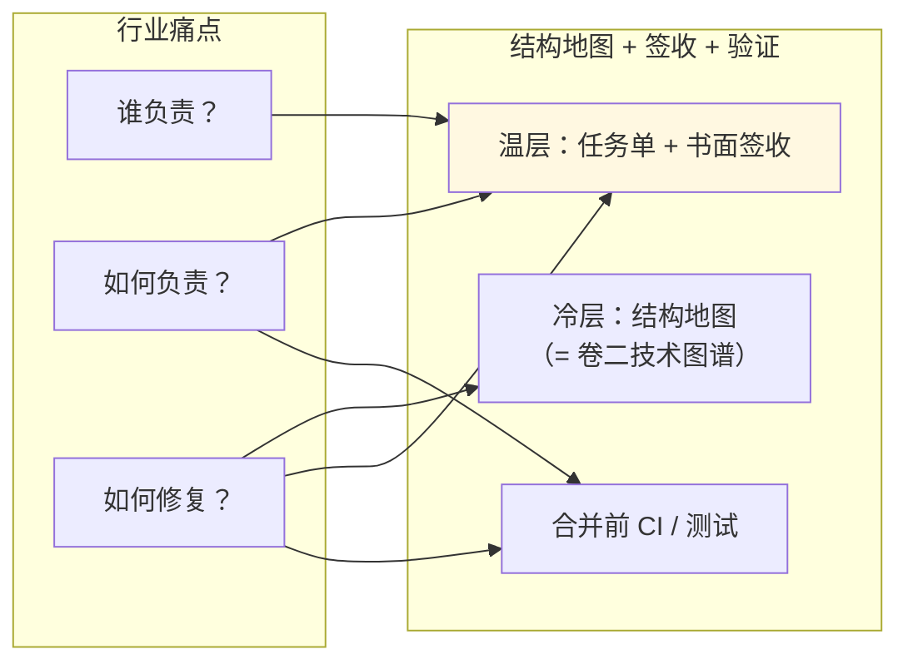


| 三问       | 本卷 + 卷二怎么补                                                            |
| -------- | --------------------------------------------------------------------- |
| **谁负责**  | **人** 在审查签收上拍板；Agent 是工具，不是责任主体                                       |
| **如何负责** | 任务单字段齐全 + 任务审核记录 + **合并前必绿**                                          |
| **如何修复** | **卷二结构地图**（本卷称冷层）定位模块与影响面；**温层** 查上次回顾摘要；**Git** 看 diff；**CI** 看哪条测试红 |


> ### **12.9 可追责包：交付物不止是 PR**

理想情况下，一轮交付除了 **PR / 代码 / 测试结果**，还应能 **一键追到依据**：


| 依据项  | 是什么                              |
| ---- | -------------------------------- |
| 任务单  | 验收、非范围、失败路径                      |
| 书面审查 | 开工前审核 + 合并前签收                    |
| 结构地图 | 本轮改动的入口与影响面（**卷二技术图谱**；本卷分层里称冷层） |
| 版本记录 | 提交历史与合并记录                        |
| 机器验收 | CI / 单测日志                        |


<!-- 图 2：流程图 #2 -->
<!-- 图 2：流程图 #2 -->
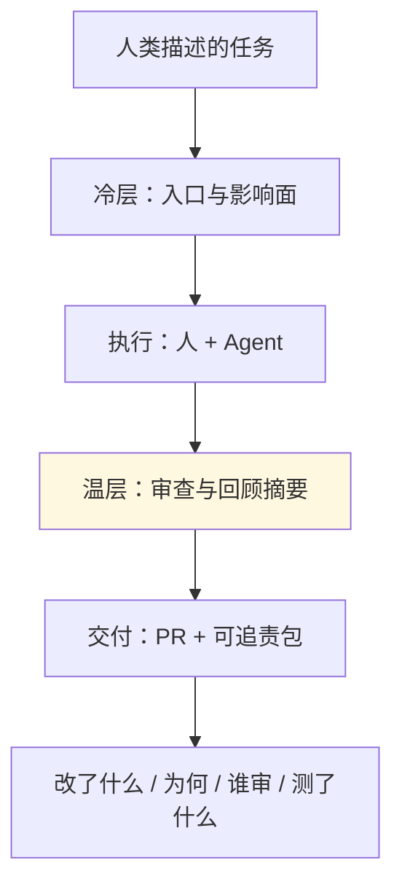


**卷二给结构地图，卷三给签字依据**——叠在一起，才谈得上「敢用 AI 规模化改代码」。验收口径在 **任务单（温层）**；**结构地图** 见卷二（本卷分层里称 **冷层**）。**热层**（运行时事件网）面向长跑与在线系统，团队内部 AI 编程现阶段通常 **不必做**（§14.8）。

> 💡 **常见疑问**
> - **Agent 写的代码，出现事故谁负责谁解决？** → 算 **签收合并的人与组织**；Agent 是执行工具。所以 **书面签收不可省**，也不是形式主义。
> - **可追责包能消除模型黑盒吗？** → 不能逐 token 解释模型；但能证明 **按什么规格、谁批准、测了什么**——这在工程与合规上通常才是「负责」的主战场。

---

> ## **13. SDD 阶段流：从需求澄清到合并**

> ### **13.1 本节要回答什么**

卷一 §2.2 **阶段骨架** 如何变成 **可执行流水线**。

> ### **13.2 阶段图**

<!-- 图 3：13.2 阶段图 -->
<!-- 图 3：13.2 阶段图 -->
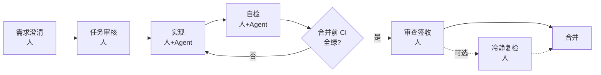


> ### **13.3 阶段表**


| 阶段       | 主要谁          | 产出          | 图谱 / CI           |
| -------- | ------------ | ----------- | ----------------- |
| 需求澄清     | 人 + Agent 辅助 | 任务单初稿       | 可选：主图/子图入口        |
| 任务审核     | 人            | 书面审核结论      | 核对 §11 字段         |
| 实现       | 人 + Agent    | 代码、文档       | 按 §11.5：**必须自动化** 时先有可失败测例再改实现；**建议有测** 时同 PR 补测；按入口改图（卷二） |
| 自检       | 执行者          | 命令输出 + 验收摘要 | 本地或 CI 预跑         |
| 合并前 CI   | 机器           | workflow 全绿 | 单测、lint、图谱门禁等     |
| 审查签收     | 人            | 签收记录        | CI 绿 + 任务单勾选      |
| 合并       | 人            | 进主干         | —                 |
| （可选）冷静复检 | 独立视角         | 隔日复核        | 高敏建议              |


> ### **13.4 SDD 一句**

**规格驱动**：先写清 **验收与边界**（任务单 ± SPEC），再让 Agent 改实现——代码是规格的可执行表达。

> ### **13.5 机器与人**


| 角色       | 管什么                           |
| -------- | ----------------------------- |
| CI / 单测  | **行为不漂移**                     |
| 图谱门禁（若有） | 流程图、入口清单与代码 **大致一致**（卷二 §9.5） |
| 人        | **敢不敢合**                      |


CI 绿了，仍要人看 **范围与风险**。

> ### **13.6 与卷一阶段骨架的对照**

卷一文字版：

```text
需求澄清 → 任务审核 → 实现 → 自检 → [CI 全绿?] →（否，回实现）→ 审查签收 → 合并
```

本卷增补：**任务审核** 可阻塞实现；**独立复检** 为可选加强，不替代签收。

> ### **13.7 收尾后与「温层」（指针）**

任务 **归档 / 收尾** 时留下的 **任务单终稿、审查记录、回顾摘要**，在分层愿景里属于 **温层——协作轨迹**：记的是 **「这次为何这样改、谁签收」**，**不必重画整张结构地图**（结构地图属冷层，即卷二技术图谱；只在模块连线真的变了时才更新，见卷二）。

<!-- 图 4：13.7 收尾后与「温层」（指针） -->
<!-- 图 4：13.7 收尾后与「温层」（指针） -->
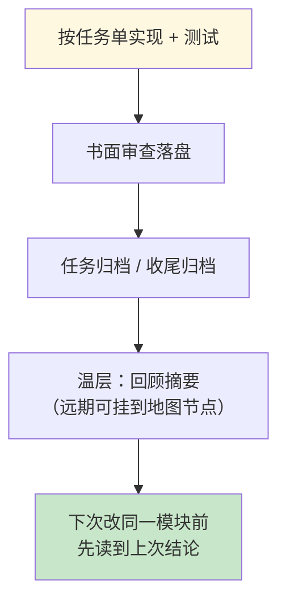


**卷四** 展开如何把回顾摘要蒸馏成 **经验卡片 / 编译摘要**，让下一轮 **少翻全文**；仍 **不替代** 卷二地图答「改哪里」。**热层**属远期场景，本卷不展开。

---

> ## **14. 半自动协作：何时链式、何时必须人工闸**

> ### **14.1 本节要回答什么**

Agent 能否 **一条对话** 里连续写任务、改代码、跑自检？何时 **必须停** 等人？

> ### **14.2 半自动 ≠ 全自动**


| 可以链式                 | 仍须人做        |
| -------------------- | ----------- |
| 小改动：实现 → 自检 → 整理审核材料 | **任务审核** 终局 |
| 工具内切换「角色说明」          | **审查签收**    |
| 自动跑测试、贴日志            | **合并主干**    |


参考 **Ralph Loop** 一类全自动编排系统：**四步封闭循环**（规划→实现→审查→结束），机器可连续跑完一轮。

**笔者选型是签收型流程**：省重复填表，**不**省人的签收与合并责任。

> ### **14.3 人工闸**

任务单可用 **「待批准 / 已批准」** 表标记关键决策；Agent 在「待批准」时 **应停止** 进入实现。


| 闸（示例名）  | 典型阻塞    | 谁改「已批准」        |
| ------- | ------- | -------------- |
| 初稿任务单   | 任务审核、实现 | 负责人（**默认人**）   |
| 审核后     | 实现      | 读过审核记录的人（默认人） |
| 复检后（可选） | 收尾、合并   | Tech Lead      |
| 发布前（可选） | 合入主干    | 维护者            |


**默认由人** 把「待批准」改为「已批准」——**未显式授权的 Agent 不得代填**。初期建议坚持默认由人改「已批准」：人工闸还没走顺时，不要让实现 Agent 自行批准。

进阶：在 **OpenClaw** 等带 **总调度权限** 的模式里，理论上可以给某一 Agent **书面授权** 代填「已批准」（须可审计：谁授权、何时、依据哪份审核记录）。闸走顺之后，加上有权限的签收代理通常很快；**阶段顺序与任务单字段不变**。笔者尚未在自家流程里完整落地这一层，但整条 SDD 流水线不必因此改写。

§13 阶段图里的「人」，文中均指 **默认执行者**；若使用已授权、留痕的签收代理，仍须满足上段的授权与审计要求。

> 💡 **常见疑问**
> - **以后能让总调度 Agent 代点「已批准」吗？** → 可以作为进阶，但须显式授权与留痕；**默认仍建议人**。流程不变，变的是 **谁被授权点这一下**。

> ### **14.4 何时开链式、何时关**


| 类型           | 建议               |
| ------------ | ---------------- |
| 小 bug、文档、单文件 | 可 **半自动**；仍须终轮签收 |
| 跨模块、契约、架构    | **强制人工闸**；多轮任务审核 |


半自动省的是 **复制模板**；**不保证** 模型不越界——纪律来自任务单 + 书面记录。

> ### **14.5 换上下文（Fresh Context）纪律**

任务审核、独立复检时，输入只保留：**任务单、审查记录摘要、diff 要点、自检输出**——**不要** 粘贴整段实现过程长文。交给审核或复检的「三件」：**改了什么、跑了什么命令、验收表结论**。这与「审查者不与实现者共用记忆」同一精神。

**新开对话** 是最稳的做法；**同一对话里换角色说明** 也可：阶段之间切换「写任务单 / 审核 / 实现 / 自检 / 独立复检」等提示词，到审核或复检环节 **只贴三件套、不贴实现长文**，即在单窗口里做 **逻辑上的 Fresh Context**（与 §14.7 默认路径一致）。

**极简示例**：粘贴 **任务单全文 + `git diff --stat`（或 diff 摘要）+ 自检命令输出** 三件套即可开始审核或复检。

> ### **14.6 与 Cursor / Claude Code 的关系**

工具可连续对话；**流程** 来自任务单与签收习惯。换工具时，**意图 / 成果 / 验收** 字段应可迁移（卷一 §0）。

> ### **14.7 默认纪律：一个任务、一个对话、一个 PR**

在 **任务单 + 地图 + 书面签收** 架构下，笔者推荐的 **默认路径** 是：

```text
一个进行中的任务 → 一个 Agent 对话窗口 → 一条审查与收尾链 → 一个 PR
```

**同一对话可串完整链**：从任务单 → 任务审核 → 实现 → 自检 → 审查签收 →（高敏可选）独立复检 → 归档。**不必** 为每个阶段另开 Agent 或另开窗口——阶段之间 **换帽 / 换角色说明** 即可（§14.5）。独立复检可在同窗口完成，前提是 **只审 diff/日志/验收表**，不共用实现过程记忆；高敏或上下文对不齐时，再另开对话。

<!-- 图 5：14.7 默认纪律：一个任务、一个对话、一个 PR -->
<!-- 图 5：14.7 默认纪律：一个任务、一个对话、一个 PR -->


| 问题              | 建议                                               |
| --------------- | ------------------------------------------------ |
| 同一任务开多个对话分工？    | **避免**——上下文分裂，收尾与可追责包会对不齐                        |
| 两个无关任务同时要交？     | **可以两个对话**，但须 **独立 Git 分支与工作目录**，勿共用同一份 checkout |
| 多 Agent 自动派活长跑？ | **远期**场景；与本节「一任务一 PR」不矛盾——那是编排器拆成 **多个任务**       |


这与「用 AI 盯同事谁改了哪个文件」无关：**谁改了哪行** 看 **Git**；**是否符合任务范围** 看 **任务单与审查**；**改 A 影响谁** 看 **卷二地图**。

> ### **14.8 现阶段：冷 + 温已够支撑研发**

若场景是 **团队内部用 AI 协作写代码**、尚无大量真实用户流量，**卷二结构地图（本卷称冷层）+ 本卷签收与任务单（温层）+ Git/CI** 通常已够，**不必** 为协作单独上「运行时事件记忆」：

<!-- 图 6：14.8 现阶段：冷 + 温已够支撑研发 -->
<!-- 图 6：14.8 现阶段：冷 + 温已够支撑研发 -->
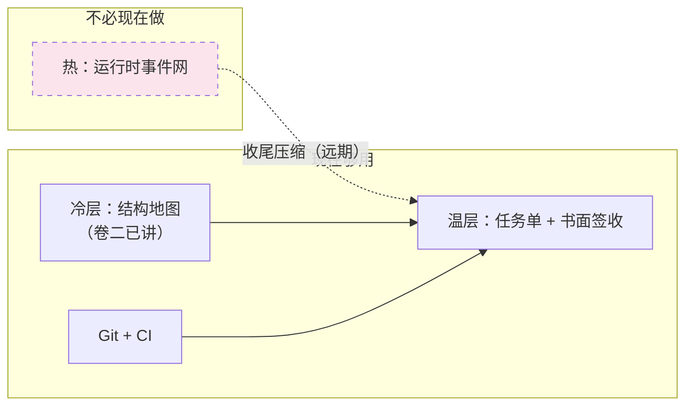


---

> ## **15. 存量 / 无 CI：阶段流降级**

> ### **15.1 本节要回答什么**

老项目、**还没有 CI** 时，如何 **不降质地缩水**。

> ### **15.2 与卷一 §5 衔接**

先补 **手动门禁**（命令写进任务单），再逐步上 CI。

> ### **15.3 降级对照**


| 有 CI                  | 无 CI 降级                          |
| --------------------- | -------------------------------- |
| PR 上 pytest / lint 全绿 | 合并前 **本地** 跑同一命令，要点贴进 **签收记录**   |
| 图谱 check workflow     | 合并前 **手动** export/check（命令写进任务单） |
| 任务审核书面记录              | **不可省**；模板可缩短                    |
| 独立复检                  | 一人团队：合并后 issue / 日记自检            |


> ### **15.4 与产品工单叠加**

任务单 = **工程交付** 依据；工单 = **产品沟通**。先 **一轮** 手动闭环，再补 CI。

> ### **15.5 领域结构检查（进阶）**

除通用单测与图谱契约门外，可为 **高频错误响应、流式事件名** 等增加 **小脚本结构检查**，与 pytest 并列进 CI——思路类似「报告结构 Linter」：专查最容易出现结构偏差的 JSON/API 形状，域按你业务自定。

笔者在 **示例后端 API 项目** 中已落地首条：**结构化错误响应** 的必填字段由注册表 + 脚本校验（理论对齐 P1，PR #92），收尾复检 PR #93。你的仓库可从「一种最容易出现结构偏差的 JSON 形状」起步，不必一次做全。

---

> ## **16. 结语**

<!-- 图 7：16. 结语 -->
<!-- 图 7：16. 结语 -->
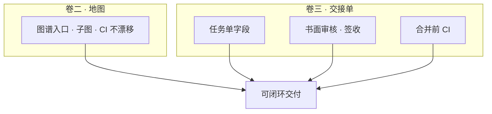


卷二给 **结构地图**（本卷分层里称 **冷层**）；卷三给 **签收纪律**（**温层**）。叠在一起，才适合 **Auto 模型、预算有限** 的日常里 **稳定合并**。

AI 编程要规模化，关键不只是让模型多写几行代码，而是 **每次交付都能回答：谁签的、依据什么、影响多大、怎么回滚**（§12.8）。先建好 **白盒轨迹的地基**，再谈把更多执行交给 AI——顺序反了，只会更快产出 **不敢合并、也不敢背锅** 的改动。

下一卷 **卷四**：展示 **一整轮专题从 SPEC 到归档** 的完整例子，以及收尾后 **温层摘要如何压缩成经验卡片**（仍不替代图谱与任务单）。冷/温/热完整愿景见独立篇（可选读；发表版链接待补）。

---

---

> # **卷四 · 闭环交付与经验沉淀——从 SPEC 到跨轮回顾摘要**

> release **v1.1.0** · https://cloud.tencent.com/developer/article/2680278

---

> ## **摘要**

若你还没读过 **卷一～卷三**，建议先看：卷一讲意图 / 成果 / 验收；卷二讲 **技术图谱**；卷三讲 **任务单、书面签收、合并前自动检查**。

**本卷讲合并之后**：一整轮有边界的专题，如何从写清任务单走到 **收尾归档**；以及（可选）怎样少翻冗长的协作留痕。

卷三解决 **敢不敢合并**；卷四解决 **合完有没有收好尾**。核心一句：**跨轮回顾摘要** 帮你在跨任务回顾时 **快速定位当时的决策**；**不替代** 技术图谱回答「改哪里、影响谁」——那是卷二的事。

下文用笔者在 **示例后端 API 服务 + 可选 Next/BFF 前端** 上的一次虚构专题，走通 happy path，并演一次 **契约检查拦住合并** 的主线失败（§17）；§18 说明收尾后 **经验卡片、团队 Skill、编译摘要** 如何分工，以及笔者在后端示例仓做过的 **跨轮回顾对照**（有数字边界，勿外推）。

---

> ## **17. 一轮专题交付：从 SPEC 到归档**

> ### **17.1 本卷在协作栈里的位置**

先对齐三句话（后文不再重复）：

1. **协作流程（Harness）** 以 **任务单** 为核心：任务单是开工规格（验收、非范围、失败路径），不是与流程并列的第二套 paperwork。
2. **敢合并** = **合并前自动检查全绿** + **书面审查结论落盘**——不是「在平台上点一下 Approve 就算交付」。
3. 下文用 **一条专题** 串起卷一～三；相对 **卷一 §6 的理想路径**，本节用 **主失败分支** 说明：为什么「有地图、有任务单」仍可能被 CI 拦下，以及怎样 **同 PR 修回绿**。

> ### **17.2 什么叫「一轮专题」**

**一轮专题** = 有边界的一包工程交付，而不是和模型无限续聊。

它可以对应产品上的一个 Epic，也可以对应你们仓库里 **一条任务链**（一个主任务单 + 若干关联子任务）。关键是：

- **意图、成果、验收** 在任务单里写死（卷一 §3、卷三 §11）；
- **改哪条链路** 在任务单里挂 **图谱入口**（卷二 §8.3）；
- **结束标志** 是：代码合并 + 任务单与审查记录 **可检索** +（可选）收尾后的编译摘要（§18）。

> ### **17.3 端到端流水线**

<!-- 图 1：17.3 端到端流水线 -->
<!-- 图 1：17.3 端到端流水线 -->


各阶段 **产出什么、回哪一卷**，见下表。

| 阶段 | 本轮应留下什么 | 回指 |
| --- | --- | --- |
| 开工 | 任务单：验收清单、非范围、失败路径、测试策略；建议一行图谱入口 | 卷三 §11 |
| 实现 | 代码 + **顺手更新** 结构图（若动到流程的边/调用关系） | 卷二 §8.3、§9.5 |
| 合并前 | 与 PR 相同的自动检查 **全绿** | 卷二 §9.5、卷三 §13 |
| 签收 | 书面记录：对照任务单与 CI 的 **结束本轮** 结论 | 卷三 §12 |
| 收尾 | 任务单移入已归档目录；审查链可查 | 本节 |
| 可选 | 从已收尾材料 **编译** 的跨任务摘要页 | §18 |

> ### **17.4 案例：统一聊天流的 SSE 字段对齐（虚构）**

> （本节展示 **主线失败分支**：契约/锚点检查拦住合并，而非一帆风顺。）

以下情节 **完全匿名化**，仅说明机制；读者不必与任何真实仓库一一对应。

**背景**：示例栈为 **Python 后端 API** + **Next.js BFF** 消费后端的流式聊天（SSE）。产品要把统一聊天流里某一事件的字段名与必填项对齐，方便前端解析。

**任务单（节选）**

| 字段 | 内容 |
| --- | --- |
| **非范围** | 不改登录与会话链路 |
| **图谱入口** | 从「统一聊天」相关分册进入（卷二） |
| **测试策略** | **必须自动化**：SSE 事件字段与错误形状 |
| **合并前必绿** | 与 PR 一致的 workflow 全绿（卷三 §13） |
| **验收** | 单测绿 + 合并前检查全绿 + 审查签收 |

**节拍 1～2：开工与实现**

人先冻结任务单；Agent 按图谱入口改后端流式接口，调整某一 SSE 事件的字段名。实现者 **只改了代码**，忘记同步 **契约/锚点清单**（仓库里用清单文件声明「文档里写明的端点 / 事件 / 字段应与代码一致」——具体文件名因项目而异，公众稿只记 **机制**）。

**节拍 3：主失败分支——合并被契约检查拦住**

推送 PR 后，**契约/锚点检查** 变红（与单测 workflow 并列，不是替代关系）。流水线给出的信息 **建议使用类似下面这种清晰提示**（勿暴露内部路径）：

```text
❌ 合并被阻塞：契约/锚点与代码不一致
位置：统一聊天 · SSE 事件 "chunk_done"
文档声明：字段 message_id（必填）
当前代码：字段 msg_id（必填）
你可以：
  1. 若确属契约变更：在任务单写明变更 → 同 PR 更新契约/锚点与结构图 → 补测试；
  2. 若为误改：回滚相关代码；
  3. 本地运行与 PR 相同的检查命令，确认变绿后再 push。
```

这就是读者常问的 **「图谱 / 契约 CI」**：不是玄学，而是 **机器对照「你承诺的对外形状」与「仓库里实际代码」**。它管的是 **门牌号对不对**，下文 17.5 再补一句 **具体行为** 与签收纪律。

**路径 A（本案例采用）**：确认产品就是要改名 → 在任务单补 **变更说明（Delta）** → **同一 PR** 内更新契约/锚点清单 +（若流程的边/调用关系变了）更新结构图 → 补/改 SSE 相关单测 → 检查变绿 → 审查签收 → 合并。

**路径 B（穿插一句）**：若发现是 Agent 误改字段，**回滚** 相关代码即可变绿——不必硬改文档去「凑」过检查。

**切勿** 再开一个「只改文档」的 PR 等代码 PR 先合：容易 **双 PR 死锁**。习惯应是 **原子提交**：代码 + 契约/锚点/图 + 测试 **同 PR 一起走**。若 PR 已推送才发现漏改契约/锚点，应在 **同一 PR 上补推**，不要另开「只改文档」的 PR。

**节拍 4～6：副分支、合并与收尾**

- **副分支（一句）**：有时 **契约/锚点检查** 已绿，**单测仍红**——说明 **门牌号对了，具体行为逻辑仍可能错**。这时要靠失败路径与 `pytest`（卷五 FAQ 会再展开）。
- **合并后**：验收通过，任务单移入 **已归档任务目录**；开工前审核与合并前签收的 **书面记录** 仍可查——不是「合并完就散」。
- **业务代码合并不会自动变成** 跨轮回顾摘要；摘要须 **收尾后按需** 生成（§18）。本案例 **不展开** 知识库编译 细节。

前端 BFF 的类型与消费逻辑，在同一 Epic 里 **另 PR 串行** 即可；卷四 **不展开** 改前端细节。

> ### **17.5 专题收尾纪律（通俗版）**

| 误解 | 实际 |
| --- | --- |
| 合并 = 结束 | 还要 **收尾归档**：状态、审查链可查 |
| 合并 = 自动生成知识库页面 | **无自动同步**；摘要 / LLM Wiki 页均 **可选、按需** |
| 仅点击平台 **Approve** 就行 | **机器绿 + 书面签收** 并列 |

收尾归档 **不等于** 再跑一轮全自动「打回重做」（那是进阶调优话题，卷五再提）。收尾首先是 **归档与可检索**。

**拒开工与驳回（不占主线）**：任务单字段不齐（缺非范围、失败路径、合并前必绿条等）时，应在 **实现开始前** 书面指出并 **阻塞开工**（卷三 §12.4 有清单思路，本卷不展开审核表模板）。实现不合格应 **驳回并要求** 修代码或补测，而不是只改聊天结论。

> ### **17.7 失败复盘：五类根因（建议性）**

合并后若仍要复盘，笔者建议用 **五类根因** 归类（**非** 强制录入数据库）：

1. **规格漏项**（任务单没写清的边界）  
2. **契约 / 锚点未与代码同步**（本节主线）  
3. **失败路径未覆盖的测试**  
4. **结构图与真实流程漂移**  
5. **跨端假设错误**（后端改了，前端仍按旧字段）

可附一张 **失败路径表**（卷三 §11.4），例如：

| 触发 | 行为 | 可否重试 | 用户可见 |
| --- | --- | --- | --- |
| SSE 字段与文档不一致 | 合并被阻塞 | 修代码或补锚点后重跑检查 | 开发者看 CI 日志 |

**不建议** 把「15 分钟必须响应」「全团队强制 Feature Flag」写成本文标配——视你们基础设施而定。

更细的 匿名化 踩坑备忘，可在收尾后整理进 **经验卡片** 或 §18 的编译摘要层；**不必** 规定「每个新任务必须先检索 失败案例库」。

> ### **17.8 与卷三 §13 的衔接**

卷三在阶段流末尾留过 **收尾后可选一步**；本节把它 **展开为可执行纪律**，但不重复卷三的 SDD 阶段图全文。

**AB 对照、载荷降幅等数字** 属于「收尾后怎么少翻留痕」，放在 **§18**——避免在流水线章节里混入实验结论。

---

> ## **18. 闭环后：经验卡片与跨轮回顾摘要**

> 若你 **连任务单与合并前 CI 门禁都尚未跑通**，本节可先略过；等 **跑通 3～5 个专题** 再回来看收尾沉淀。

§17 讲 **怎么合并、怎么收尾**；本节讲 **收尾之后** 多出来的三层「沉淀」：哪些是 **可选备忘**，哪些值得 **编译成摘要**，以及它们与卷二 **技术图谱**、卷一结语里的 **经验卡片 / Skill** 如何分工。

> ### **18.1 四种物件，先分清**

| 通俗名 | 是什么 | 何时写 | 谁读 |
| --- | --- | --- | --- |
| **技术图谱** | 改哪里、从哪进、会影响谁（结构地图） | 改代码、改流程时（PR 时同步更新） | 实现期（卷二） |
| **跨轮回顾摘要** | 从 **已收尾** 的任务与审查材料 **编译** 出的跨任务概念页 | Epic 收尾后 **按需** | 跨会话回顾、跨轮回顾 |
| **经验卡片** | 一轮闭环后的 **短备忘**（踩坑、命令、决策） | 合并后 **可选** | 人 + 下次开工的 Agent |
| **团队 Skill / 规则** | 编辑器里 **可复用的习惯**（命名、测试顺序） | 同类任务 **重复 ≥2 次** 后 | Agent 默认注入 |

**一句话**：图谱管 **结构**；任务单 + 签收管 **本轮交付依据**（**真值**=唯一可信依据；卷三：验收勾了什么、谁签收，**以任务单与书面记录为准**）；摘要管 **跨轮决策蒸馏**；Skill 管 **怎么问、怎么测**。

> ### **18.2 与 PRD、LLM Wiki、技术图谱的划界**

读者听到 **Wiki**，常会想到 Confluence、飞书文档里 **人工维护** 的产品百科。本文另有一类：**LLM Wiki**——由 Agent **增量编写并维护** 的 Markdown 知识库：原始资料只读，中间层页面由 LLM 交叉引用、持续整理；你主要 **提问与把关来源**，不必亲手维护每一页。理论出处见下文 §18.2.1。

这与 **PRD / 需求文档**（人写的产品规格）、**技术图谱**（改代码用的流程 / 契约 / 入口地图，卷二）、**跨轮回顾摘要**（从已收尾任务与审查材料 **编译** 出的 Epic 级决策页）都不同。

笔者在示例项目中用下表避免混用。下表与卷二 §8.5「Wiki / 需求文档」呼应，并补上 **LLM Wiki** 一列：

| 类型 | 谁维护 | 答什么 | 何时更新 | 典型误用 |
| --- | --- | --- | --- | --- |
| **PRD / 需求文档** | 产品、研发 | 产品需求、用户故事、业务规则 | 需求变更 | 当 **代码地图** 用 |
| **LLM Wiki** | Agent（人审核来源） | 多源资料 **编译** 成的主题页、交叉引用 | 新资料 **纳入知识库** | **替代** 技术图谱或 Harness 签收 |
| **技术图谱** | 人 + Agent 顺手改 | 工程入口、依赖、契约/锚点 | 改流程、PR 顺手改图 | 把 PRD 全文贴进仓库 |
| **跨轮回顾摘要** | 收尾后按需 **编译** | Epic 级 **工程决策** 与踩坑模式 | Epic 收尾后 | **替代图谱** 做影响分析 |

**跨轮回顾摘要不是 PRD，也不等于整本 LLM Wiki。** 摘要回答「这个 Epic 收尾时工程上定了什么」；PRD 回答「用户要什么」；LLM Wiki 若采用，往往是 **更广的领域知识层**（可收录摘要页，但 **不能** 代替任务单字段与合并前检查）。在笔者后端示例仓里，回顾摘要与部分 Wiki 页同属「可读沉淀层」，公众稿 **不展开** 仓内目录名。

> **与卷二 §8.5 的对照**：卷二表中「Wiki / 需求文档」主要指 **人工产品文档**；本卷补写的 **LLM Wiki** 指 **Agent 维护** 的知识库模式——二者不要混称为「产品 Wiki」。

 #### 18.2.1 借鉴 Karpathy 的 LLM Wiki：为何用在跨轮回顾

笔者在 **跨轮回顾** 场景借鉴了 Andrej Karpathy 公开阐述的 **[LLM Wiki](https://gist.github.com/karpathy/442a6bf555914893e9891c11519de94f)** 思路（业内讨论度较高，可自行阅读原文）。与「把文件丢进向量库、每次问答现检索」不同，LLM Wiki 主张：原始资料保持只读，由 LLM **持续维护** 一层可交叉引用的 Wiki 页面——知识 **编译进结构里、并保持更新**，而不是每问从碎片里重新拼凑。

**笔者为何把它落在专题收尾上？** 跑通 Harness 之后，任务单、审查记录、对话导出会 **越积越多**。半年后再问「这个 Epic 当时定了什么、踩过什么坑」，若每次让 Agent **整包读取** 全部分支留痕，上下文成本高、噪声大，回答还容易 **漂移**（本轮临时拼出的片段，与当时书面签收不一定一致）。**跨轮回顾摘要** 是在这一思路上，把 **已收尾** 材料 **蒸馏** 成少量 synthesis 页，专门服务跨会话回顾——属于 **初步** 缓解「文档越来越多、回顾越来越难」，不是一劳永逸的知识管理产品。

**为何不把传统 RAG 当主方案？**（针对 **本项目协作留痕**，不是否定 RAG 的全部用途）

| 做法 | 在跨轮回顾上的短板 |
| --- | --- |
| **传统 RAG**（上传 task/review，按问检索 chunk） | 每问 **重新发现** 知识，缺少 **跨轮积累**；合成多份留痕时容易漏约束、口径飘 |
| **按项目文档做通用 chunk** | 切分粒度、元数据、更新策略成本高；对 **边界已冻结的已收尾材料**，投入往往 **大于收益** |
| **更复杂的方案（如 GraphRAG）** | 对「先跑通跨轮回顾、少翻留痕」的团队，多数是 **过度工程**；本系列不展开 |

线上 **ChatBI / 用户问答** 仍可用各自的 RAG 栈；本卷只讨论 **工程收尾后的可读沉淀**。与技术图谱、Harness 签收的分工仍见上表——**摘要/Wiki 层不替代**「改哪里」的地图，也不替代「敢不敢合」的 CI 与书面落盘。

> ### **18.3 为什么需要编译摘要（故事线）**

协作一旦走 Harness，**过程留痕** 会自然变长（§18.2.1）。收尾半年后，你若仍只靠完整读取原文做回顾，成本高、噪声大，还容易漏 **跨任务的模式**（例如「这类改动必须过契约/锚点检查」）。

笔者在示例后端仓的习惯是：

```text
跨轮回顾：先看摘要索引 → 打开单篇 synthesis 摘要 → 必要时再回链原始 task/review
```

**合并业务代码 ≠ 自动生成摘要**。收尾归档（§17）之后，是否 **摘要编译入库** 摘要（或写入 LLM Wiki 的某一类页面），仍按团队纪律 **按需触发**——不是 push 到 `main` 就立刻多出一页知识库。

> ### **18.4 跨轮回顾对照：摘要层省了多少上下文？**

下面数字来自笔者在 **单一后端示例仓** 做的 **跨轮回顾** 对照实验（2026-05），**不是** 线上用户流量，也 **不等于** 模型 API 的 token 账单。实验用事先声明的 **gold 题集**：六类 **代表性收尾场景**（例如 Harness 文档试点、图谱门禁、流式探针、契约/锚点检查 CI、LLM Wiki 层元实验、Harness 与 Wiki 层闭环主任务单等），**每类四题**，在 **后端 API 单仓** 内答题（**不含** 前端 / 双仓场景）。**降幅为字符量代理**，不代表线上 API token 实际消耗；题集 **仅含后端 API 仓**，降幅 **不代表** 全行业或双仓场景的 token 账单。

**两组对比**（同一套题，只改 Agent **先读什么**；A 为基准，B 在 A 上叠摘要）

| 组别 | Agent 先读的材料 |
| --- | --- |
| **A · 仅 Harness 要点包** | 专题收尾纪律与任务要点摘录（不含冗长的多轮执行留痕全文） |
| **B · 要点包 + 回顾摘要** | 在 A 的基础上，再读 **跨轮回顾摘要**（已收尾 Epic 的 synthesis 页） |

**能写什么结论**

在同一题集下，**B 组** 相对 **A 组**，喂给模型的 **字符量（载荷代理）** 大约还能再少 **六成到七成多**（六类场景聚合约 **61%–77%**；笔者另有一类试点文档域约 **79%**，见脚注）。六类里 **五类** 四题全中；**一类** 只中了三题——因为该 Epic 的编译摘要 **漏写了测试策略字段**，有一道题 Agent 无法从摘要里还原「必须自动化」的约束。

> **脚注**：单域试点（文档试点）降幅约 **79%**；正文六类场景区间为 **61%–77%**。请勿以单域替代整体结论。

**诚实边界（不可外推）**

1. **没写进摘要的运行时细节与生产配置**，不能当事实用——仍以代码与合并前检查为准。  
2. **前端 Next/BFF** 与双仓协作须 **另行验证**，不能靠这一后端实验代替。  
3. **线上 RAG / ChatBI 排障效果** 等实现级指标，本实验 **未覆盖**。

**失败样本（必写）**

**某 Harness 与 Wiki 层闭环主任务单** 在 **B 组（叠摘要）** 下 **3/4**：根因是编译时 **未把主任务单上的测试策略枚举蒸馏进摘要**，不是模型「突然变笨」。这提醒笔者：**摘要省字** 与 **摘要写全** 要一起管——摘要编译 纪律和任务单字段一样，漏一项就会在回顾题上露馅。

> ### **18.5 什么时候读什么（读序）**

| 你的任务 | 建议先读 |
| --- | --- |
| **开工改代码** | 技术图谱 + 本轮回任务单（卷二 + 卷三） |
| **跨 Epic 回顾、写复盘** | 摘要索引 → 单篇 synthesis → 必要时回图谱或原文 |
| **配置编辑器默认行为** | 团队 Skill（卷一 §7 伏笔） |

摘要索引建议放在团队约定的归档目录（例如 `docs/archive/` 或你们自定的 `synthesis/` 路径），与 **仍活跃的任务单目录** 分开，避免 Agent 把「已收尾 Epic」当成当前开工材料。

> ### **18.6 与经验卡片、Skill 的叠放**

| 层 | 管什么 | 不替代什么 |
| --- | --- | --- |
| **Skill / 规则** | 怎么提问、怎么跑测试、命名习惯 | 合并前 CI、书面签收等 |
| **经验卡片** | 本轮踩坑与命令备忘 | 任务单字段与审查链 |
| **跨轮回顾摘要** | Epic 级决策与模式 | 技术图谱做影响分析 |
| **技术图谱** | 入口与依赖 | 产品 PRD 全文 |

**签收仍然不可省**：摘要再全，也不能代替卷三的 **非范围、失败路径、合并前必绿**。

> ### **18.7 可选：一条 匿名化 踩坑备忘**

笔者曾把「编译摘要」当成「合并后自动出现」——实际 **收尾归档后还要按需触发** 编译，否则回顾时只有冗长原文。此类备忘适合写在 **经验卡片**（一两段），不必写进每份摘要正文。

---

> ## **19. 与「只会 Prompt」的工具链如何叠加**

不少读者问：「我已经有 Cursor Rules、Copilot 指令、各种 Prompt 大全，还要学图谱和 Harness 吗？」

笔者的回答是：**要叠，但不是重复。** Prompt 管 **这一轮对话怎么说**；本系列管 **改哪、敢不敢合、收尾后怎么少忘**——三件事 Rules 很难单独承担。

> ### **19.1 各自擅长什么**

| 能力 | Prompt / Rules 典型做法 | 本系列（卷二～四） |
| --- | --- | --- |
| 语气与风格 | "用 TypeScript 严格模式"、"回答要简短" | 不替代；可放进团队 Skill（§18） |
| 单次编码 | Composer 里描述需求 | **任务单** 冻结验收、非范围、失败路径（卷三） |
| 仓库结构 | 偶尔 @ 几个文件 | **技术图谱** 给入口与影响面（卷二） |
| 合并把关 | 很少覆盖 | **合并前自动检查 + 书面签收**（卷三、§17） |
| 跨任务记忆 | 个人笔记、Notion | **跨轮回顾摘要**（§18，可选） |

**不是**「买了 Cursor Pro 就不用画地图」；也 **不是**「多贴十条 System Prompt 就等于 Harness」。

> ### **19.2 叠放关系（一张表）**

| 层 | 现有实践 | 本系列补什么 |
| --- | --- | --- |
| **会话习惯** | 编辑器 Rules、Skill | 团队 Skill：重复 ≥2 次的测试顺序、命名习惯（§18） |
| **单次任务** | Chat、Composer、Agent | 任务单 + SDD 阶段流 + 审查签收（卷三） |
| **仓库结构** | 常缺失 | 技术图谱 + 契约/锚点检查（卷二、§17） |
| **跨任务** | 笔记、飞书文档 | 跨轮回顾摘要索引（§18，可选） |

> ### **19.3 换模型、Auto 模式时靠什么**

卷一 §0 提过：在 **Auto / 换模型** 时，单条 Prompt 容易漂移；笔者更信 **流程 + 机器验收 + 高敏书面复检**：

- 任务单字段不随模型变而消失；  
- 合并前检查仍须全绿；  
- 动对外 API、流式协议时，仍建议 **独立复检**（卷三 §12.5）。

若团队想 **换模型前自检**，可自行列 **几条定性问题** + **可选** 的小场景自测表（卷五将提供可复制模板）——结果 **仅供内部讨论**，**不作** PR 合并条件，也 **不设**「模型成功率 KPI」。那是纪律辅助，不是新的闸门。

> ### **19.4 最小叠加建议（三条）**

若你已有 Prompt 库，想 **最小成本** 叠上本系列，笔者建议顺序：

1. **保留卷一 §6 任务单骨架**（验收、非范围、失败路径、合并前必绿）——明天就能用。  
2. **选一条链路画最小地图**（卷二 §8.2–8.3），任务单写图谱入口。  
3. **收尾后可选**：写一张 **经验卡片**；同类任务重复两次再沉淀 **团队 Skill**；Epic 结束再考虑 **编译摘要**。

范例栈是笔者在用的 **后端 API + 可选 Next/BFF 双仓** 组合，**不是**「一个 React 单体教程」——全栈读者请按自己的仓拆成 **契约 + 分栈合并前命令**（卷一 §6 分栈）。

---

> ## **20. 结语**

卷四把卷一～三收束成 **一条可执行的专题收尾故事**：

| 卷 | 你带走什么 |
| --- | --- |
| **卷一** | 意图 / 成果 / 验收；图谱与流程 **叠放** |
| **卷二** | 技术图谱：先看地图再动手 |
| **卷三** | 任务单、书面签收、合并前必绿 |
| **卷四** | 专题跑通 + 收尾归档；（可选）编译摘要 **少翻留痕** |

**图谱** 回答改哪里；**Harness** 回答敢不敢合；**跨轮回顾摘要** 回答跨 Epic 怎么回顾——三者 **都不替代** 彼此。

若你读卷三时对 **冷层 / 温层 / 热层** 仍有「是不是架构三层」的疑惑：卷三正文已发表；请以 **[卷五 §23.1](https://github.com/Cyning12/ai-coding-closed-loop-articles/blob/main/ARTICLE_AI_Coding_可闭环协作_公众稿_vol5_v1.0.0_zh.md)** 对照表为准（协作记忆分层，不是架构 / 契约 / 实现）。

**下一卷 · [卷五](https://github.com/Cyning12/ai-coding-closed-loop-articles/blob/main/ARTICLE_AI_Coding_可闭环协作_公众稿_vol5_v1.0.0_zh.md)** 面向 **存量项目**：一周量级如何试通一条链、常见误区、渐进路线；附册（术语、模板、延伸阅读）将另行连载；卷五 §26 链出 **Blocking 三行模板** 与 **换模型定性自检** 等规划附件。

新项目：从卷一 §6 起步。老项目：从卷五 **阶段 0**（手动门禁写进任务单）起步。

---

> # **卷五 · 存量项目怎么落地——案例、误区与渐进路线**

> release **v1.0.1** · GitHub release（腾讯云待发）

---

> ## **摘要**


卷一～四讲的是 **框架**：意图 / 成果 / 验收、技术图谱、任务单与签收、**专题收尾**（一轮交付合并后的归档，卷四 §17）。若你的仓库已经跑了很多年，常见状态是：**文档与代码分叉、CI 不全、不敢让 Agent 碰核心路由**——卷五专门回答：**存量项目怎样用「一周量级」试通一条链，而不是两周铺满全仓。**

**本卷三件事**：

1. **两则匿名周记案例**（§21 后端横切 · §22 全栈契约）——情节虚构化，只讲机制；
2. **FAQ**（§23）——含卷三读者常问的 **冷/温/热 ≠ 架构三层** 对照表（**不改卷三已发正文**）；
3. **渐进路线**（§25）——阶段 0～3，与卷一 §6 最小起步衔接。

**本卷立场（与卷一～四同向，卷五说透）**：闭环是为了让 AI Coding **更准确、更敢合**——**不是**在「人本来就能较快做完」的事上强行多走 Agent、多填表、多改图。人把住 **关键节点**（任务单、合并前检查、签收、高敏复检）；试点链上沉淀 **示范性样板**（完整 PR 留档，供 Agent 模仿），日常 **大部分实现与图谱增量由 Agent 按样板起草、人审 diff**（**示范性** = 可模仿、可随栈迭代，**不是**一成不变的标准答案）。

**范例栈说明**：案例基于笔者在用的 **Python 后端 API + 可选 Next.js BFF** 双仓组合；**不是**「React 单体 + Node 一把梭」教程。全栈读者请按自己的仓拆成 **契约 + 分栈合并前命令**（卷一 §6）。

若你**尚无**合并前验收（CI 或等价手动门禁），请从 **§25 阶段 0** 或卷一 §6 开始，不要跳过「验得动」。

---

> ## **21. 存量案例：后端横切改动的一周**

> **本节要回答**：在 **几乎没活图谱、CI 可能不全** 的后端仓，如何用 **一条非核心链路** 跑通卷一～三的最小闭环。

以下情节 **匿名化**；读者不必与任何真实仓库一一对应。

> ### **21.1 背景：为什么选「内部工具 API」当第一条链**

**示例栈**：多模块 **Python 后端 API**（问答、入库、管理类路由并存）；向量检索与业务库在概念上并存，但 **本案例不展开 RAG 细节**。

**存量阻力（常见）**：


| 现象               | 后果                  |
| ---------------- | ------------------- |
| 文档里的端点列表与代码不一致   | Agent 改 A 仍按旧文档理解 B |
| 合并前检查不完整或无人看     | 「聊过了」就合，心里没底        |
| 核心用户链路不敢交给 Agent | 框架永远停在 PPT          |


**试点选链（定稿原则）**：第一条走 **内部工具 / 观测 / 配置类 API**——横切、可测、**不直接碰登录 / 支付**。推广顺序建议：**内部 → 后台 → 登录 → 支付**（先非核心，再碰用户面）。

本案例假设产品要在 **内部健康检查接口** 上补一项 **结构化错误码** 与 **契约字段对齐**（与卷四 §17 同类：**门牌号** = 契约/入口清单与代码一致，但本节 **不演 CI 红**，只走通 happy path + 一条诚实切口）。

> ### **21.2 Day 0～1：先「验得动」**

**目标**：合并前必须能回答「敢不敢合」——没有 CI 也要 **手动门禁**（卷三 §14.1 · 卷一 §6）。


| 产出      | 内容                                    |
| ------- | ------------------------------------- |
| 合并前命令清单 | 与 PR 相同的 `pytest` 子集 + lint（示例；以你仓为准） |
| 任务单字段   | 验收 3 条 · 非范围 2 条 · 失败路径至少 1 条         |
| 书面习惯    | 合并前自勾表拍照或 Markdown 留档（一人团队 **不可省**）   |


**诚实切口**：该示例仓当时 **尚未** 配齐契约/锚点自动检查；Week 1 只要求 **单测绿 + 书面自勾**。全量 **入口清单** 检查放在 **§25 阶段 2**，不在第一周强上。

> ### **21.3 Day 2～3：再「有地图」——70 分即可**

按卷二 §8.2～8.3  checklist，只画 **一条链**：

1. **主图** 上标出「内部工具 API」入口方块（不必画满 RAG / 全库）；
2. **一篇分册**（子图）展开：该路由依赖哪些模块、改坏会影响谁；
3. 任务单写一行 **图谱入口**（卷二 §8.3）。

**不必** 第一周补全全仓子图。主图 + 一篇分册 = **70 分即可开工**。

> ### **21.4 Day 4～5：敢改 + 签收**

**任务单（节选 · 虚构）**


| 字段       | 内容                                     |
| -------- | -------------------------------------- |
| **意图**   | 内部健康检查接口返回统一错误码形状                      |
| **非范围**  | 不改统一聊天流 · 不动登录                         |
| **图谱入口** | 分册：`10_flow_internal_health.md`（示例文件名） |
| **验收**   | 单测绿 + 合并前命令全绿 + 书面签收                   |
| **失败路径** | 缺必填字段 → 400（单测覆盖）                      |


**实现**：人冻结任务单；Agent 按分册改 handler 与单测。改完对照 **审查自勾表 + CI（或手动等价）**。

**签收（本案例 · 小团队）**：

本案例动的是 **内部工具 API**：**作者自检 + CI（或手动门禁）+ 自勾表落盘**即可，不是「感觉对了」。**若改动触及对外 API、核心路由或契约清单**，仍须 **独立复检**（卷三 §12.5 精神）——**书面记录不可省**。

> ### **21.5 一周结束后：刻意不做什么**


| 没做              | 为什么可以接受              |
| --------------- | -------------------- |
| 全仓图谱            | 阶段 1 只证明 **一条链** 可闭环 |
| 跨轮回顾摘要 / 知识库编译 | 卷四 §18 可选（跨轮回顾摘要）；Week 1 不展开 |
| 对照实验数字          | 不外推；卷二 §9 题集另论       |
| 强制踩坑库检索  | 可选失败案例备忘；**非**系列标配     |
| 全仓「人手永久维护图谱」 | 阶段 1 要的是 **示范性样板 PR**，不是维护制度本身 |


**一周真正要留下的**：一条可检索的 **示范性样板**（代码 + 最小图 + 任务单 + 签收）；下一轮同类改动让 Agent **按该样板** 改实现与图，人审 diff——**不是**证明「以后每条 API 都靠人手绘全仓图」。

**读者可带走的 3 条检查项**：

1. 合并前命令是否 **写进任务单** 且本轮 **跑过**？
2. 是否 **只选一条非核心链** 并写清图谱入口？
3. 合并后是否留下 **可检索的书面签收**（哪怕只有自勾表）？

> ### **21.6 与卷四的关系**

卷四用 **虚构专题 + 契约 CI 红** 讲 **专题收尾** 与失败分支；本节用 **更小的存量切口** 讲 **第一周怎么动起来**。两条故事 **互补**：本节 happy path；卷四 §17.4 主失败分支。

---

> ## **22. 存量案例：前端 BFF + 契约类需求**

> **本节要回答**：全栈存量里 **前端 BFF** 如何与 **后端契约 / 技术图谱** 对齐；与 §21 的差异是 **跨端契约同步**，不是再讲一条纯后端 RAG 链。

以下情节 **匿名化**；范例为 **Python 后端 API + Next.js BFF** 双仓，**不是** React 单体一把梭教程。

> ### **22.1 场景：后端已改，前端还在按旧字段解析**

**背景**：产品要在 **统一聊天流** 上调整某一 SSE 事件的字段名与错误形状（与卷四 §17.4 **同类机制**，本节 **不重演** CI 红，侧重 **双仓怎么分工**）。

**常见卡点**：


| 卡点                      | 后果                                                              |
| ----------------------- | --------------------------------------------------------------- |
| 后端契约清单已更新，BFF 类型与消费逻辑仍旧 | 本地 lint 过、联调才炸                                                  |
| Agent 只改前端页面代码          | 不知道 Python 侧 **契约/锚点** 已变                                       |
| 两仓各开 PR、无顺序             | 双 PR 死锁或「文档 PR 等代码 PR」卡死（卷四 §17.4 已强调 **同 PR 原子提交**；跨仓用 **串行**） |


> ### **22.2 任务单：把「跨端」写进非范围**

**任务单（节选 · 虚构）**


| 字段       | 内容                                                         |
| -------- | ---------------------------------------------------------- |
| **意图**   | BFF 按后端新 SSE 字段消费；页面展示一致                                   |
| **非范围**  | **本期不动** 后端 handler（后端已在上一 PR 合入）；或反向：本期 **只改后端**，BFF 跟进另开 |
| **图谱入口** | 后端主图「统一聊天」分册 + 前端「BFF 代理层」分册（各仓各一行）                        |
| **验收**   | 前端 `lint` + `test` + `build` 全绿；联调脚本通过；书面签收                |
| **失败路径** | SSE 缺字段 → 前端降级提示（单测或契约测试覆盖）                                |


**关键**：**非范围** 必须写清 **动哪一端、哪一端冻结**——否则 Agent 会「顺手改后端」导致契约再次分叉。

> ### **22.3 串行 PR：先后端，再 BFF（一人团队也适用）**


| 顺序    | 做什么                              | 为什么                |
| ----- | -------------------------------- | ------------------ |
| **1** | 后端 PR：代码 + 契约/锚点 + 单测 + 结构图（若需要） | 先定 **门牌号**（卷四 §17） |
| **2** | 后端 PR 合入并完成书面签收                    | BFF 才有稳定契约可读       |
| **3** | 前端/BFF PR：类型、代理、页面消费             | 跟已合并的后端对齐          |
| **4** | 前端合并前检查全绿 + 签收                   | 与卷一 §6 分栈命令一致      |


一人团队可以 **同一周串行**，不必假扮「双评审委员会」；但 **两轮都要有书面记录**（§23.5）。

<!-- 图 1：流程图 #1 -->
<!-- 图 1：流程图 #1 -->


> 若平台不渲染 Mermaid，可按上表 **顺序 1→4** 执行即可。

**切勿**：后端 PR 未合就改 BFF 去「凑」旧字段，再在另一个仓开「只改文档」的 PR 等后端——卷四 §17.4 的 **双 PR 死锁** 在跨仓场景同样成立。

> ### **22.4 前端合并前检查（概念级）**

与卷一 §6 一致，**按栈写死**，示例：

```text
lint → test → build
```

有 E2E 再加一步；**无 CI** 则写入任务单当 **手动门禁**。BFF 层另可增加 **契约测试**（消费后端发布的错误形状表），名称因项目而异，公众稿只记 **机制**。

> ### **22.5 与 §21、卷四 §17 怎么分工**


| 篇 / 节        | 讲什么                                |
| ------------ | ---------------------------------- |
| **§21**      | 存量后端 **第一周** happy path（内部 API 试点） |
| **卷四 §17.4** | 后端专题 **契约 CI 红** + 同 PR 修绿         |
| **本节 §22**   | **双仓契约跟进**、任务单非范围、串行 PR            |


读者若只做后端，§21 + 卷四 足够；若全栈，**加上本节** 再对照 §25 阶段 1 的「前后端可并行不同链」。

> ### **22.6 诚实切口**


| 没做 / 不宣称            | 说明                                   |
| ------------------- | ------------------------------------ |
| 自动双仓 parity 流水线     | 范例 **手工** 任务单 + 串行纪律，非开箱 monorepo 魔法 |
| 协作记录量减少幅当卷五 KPI | 卷四 §18.4 对照实验 **不外推**（§24）                  |
| 前端覆盖所有页面            | 只改 **统一聊天** 相关 BFF 路径                |


---

> ## **23. 常见误区 FAQ**

> **本节要回答**：存量读者在试框架时最常卡住的 **概念与顺序** 问题。每条可 **单独摘发**；若你刚读完卷三又对「冷/温/热」犯迷糊，**先看 §23.1 对照表**（**不改卷三已发正文**，以本卷为准）。

> ### **23.1 冷 / 温 / 热：不是架构三层**

卷三 §11.2.1、§14.8 用 **冷、温、热** 比喻 **协作里信息放哪、留多久**。不少读者会下意识对齐成「架构分层」或「代码能不能改」——**本系列不是这个意思**。


| 常见误解                    | 本系列实际指什么                                                                                       |
| ----------------------- | ---------------------------------------------------------------------------------------------- |
| 冷 = 架构层、温 = 契约层、热 = 实现层 | **否**。冷/温/热是 **协作记忆分层**，不是软件三层架构。                                                              |
| 冷 = 只读代码、温 = 可改文档       | **否**。冷层 = **结构地图**（卷二 **技术图谱**：主图 + 子图）；温层 = **本轮交付轨迹**（任务单、书面签收、可选 **跨轮回顾摘要**）。                     |
| 热 = 线上监控大盘、告警大屏         | **相关但不等同**。热层 = **运行时事件记忆**（日志聚合、事故时间线等）；**远期**能力，日常闭环 **不依赖** 热层。卷三 §14.8 只做划界，卷五 **不展开** 运维细节。 |


**一句收束**：

- **冷层** = 地图（改哪里、从哪进、会影响谁）→ 卷二；  
- **温层** = 轨迹（谁定了什么、何时敢合并、**收尾后**怎么回顾）→ 卷三、卷四；  
- **热层** = 事件记忆（可选、远期）→ 本卷不教你怎么搭监控栈。

若团队内部已有「架构冷/温/热」别种说法，请在 README 或术语表 **写清映射**，避免和本系列混用。


**分层示意图**（协作记忆，**不是**架构三层；自下而上为常用叠放顺序）：

<!-- 图 2：流程图 #2 -->
<!-- 图 2：流程图 #2 -->
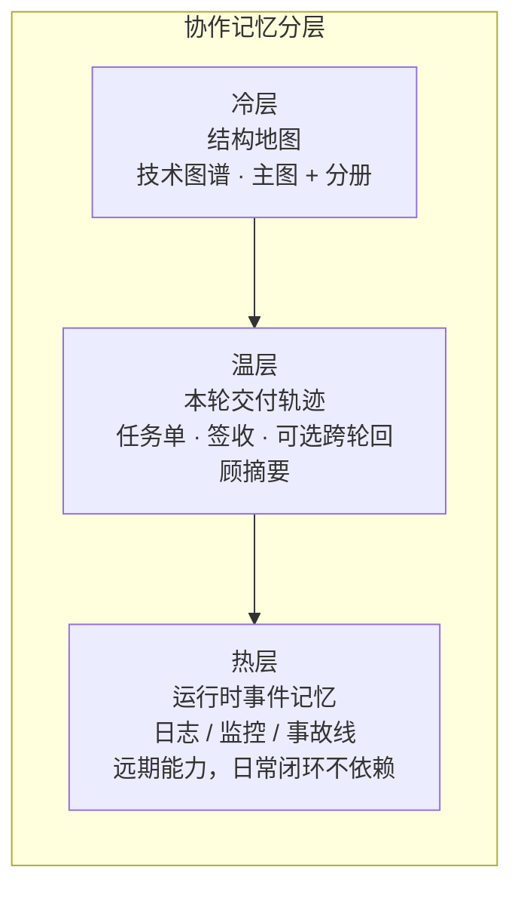

> ### **23.2 先搭协作流程，还是先画图谱？**

**不必二选一，但要有顺序感。**


| 阶段      | 先做啥                 | 说明                                                    |
| ------- | ------------------- | ----------------------------------------------------- |
| **0**   | **验得动**             | 合并前命令清单（有 CI 用 CI，没有就 **手动门禁** 写进任务单）——卷一 §6、卷三 §14.1 |
| **1**   | **一条链 + 任务单 + 最小图** | 试点链闭环一轮；主图 + **一篇** 分册即可开工（卷二 §8.2～8.3）               |
| **2 起** | 图谱检查、对照、可选跨轮回顾摘要      | 卷二 §9、卷四 §18                                          |


**误区**：没 CI、没任务单字段，先画满全仓图谱——图会很快 **和代码分叉**，没人敢用。  
**误区**：只有流程、没有图谱入口——Agent 仍易 **改错范围**（卷一 §2.3 叠放）。

> ### **23.3 协作留痕会不会越积越厚？**

**会涨，这是正常现象。** 任务单、审查记录、对话导出都会变多。

本系列的应对是 **分层**，不是「别留痕」：


| 层级       | 作用                   | 是否必选       |
| -------- | -------------------- | ---------- |
| 任务单 + 签收 | **本轮交付依据**（验收勾了什么、谁签收，**以它为准**） | 必选         |
| 技术图谱     | 结构 **地图**（改哪里、影响谁）           | 试点链起就要有入口  |
| 跨轮回顾摘要   | 跨轮 **蒸馏**、少翻 **一整轮旧执行留痕全文**   | 可选（卷四 §18） |


笔者在后端示例仓做过 **跨轮回顾对照**（字符量降幅、失败样本、**不可外推** 边界）——见卷四 §18.4；**不是**「装了摘要就不用图谱」。

> ### **23.4 不会写导出脚本，图谱怎么起步？**

**先「表格 + 手画」，再自动化。**

1. 用表格列：**入口 / 依赖谁 / 改坏会影响谁**（卷二 §8.2 新项目 vs 存量）；
2. 挑 **一条** 核心链，画一张 Mermaid 主图 + 一篇分册；
3. 任务单写 **图谱入口** 一行；
4. 有精力再接 PR 改图提醒、export/入口清单 检查（卷二 §9.5）。

**误区**：等「完美工具链」再动手——存量仓往往 **永远等不到**。

> ### **23.5 一人团队，审查和签收怎么做？**

**可以没有第二个人点 Approve，但不能没有「验收 + 书面落盘」。**


| 做法         | 说明                                                                                            |
| ---------- | --------------------------------------------------------------------------------------------- |
| 作者自检       | 对照任务单验收清单逐条勾                                                                                  |
| 合并前检查      | CI 全绿，或 **与 PR 相同的手动命令**                                                                      |
| 自勾表（自我检查勾选清单） | Markdown、PR 描述、内部笔记均可；要 **可检索**                                                               |
| 独立复检       | **动对外 API、流式协议、契约清单、核心路由** 时，建议 **另起一行** 对照任务单与 CI 日志（卷三 §12.5 精神）——一人也可 **间隔一段时间再看一遍**，关键是 **书面** |


§21 案例：内部路由可自检；§22 强调 **跨端契约** 时更要写清 **非范围**。

**附册 B**（规划）将收 **Blocking 三行模板、双轨 PR** 等可复制清单；正文 **不展开** 内部编号。

> ### **23.6 图谱会不会过时？要不要「半自动」？**

**会过时；目标是降漂移，不是归零维护，更不是「全仓人手永久绘图」。**

 #### 试点之后的三层分工

| 层 | 谁 | 做什么 |
| --- | --- | --- |
| **约定与拓扑** | 人 | 边标记、锚点约定（卷二协议）；**低频** |
| **示范性样板** | 人 + Agent（阶段 1） | 一条链上 **1～2 个完整 PR** 留档（代码 + 图 + 清单 + 任务单 + 签收），供后续模仿 |
| **日常** | **Agent 起草 + 人审** | 改接口的 **同一 PR** 内更新分册/清单；人审图 diff；CI 查 **门牌号**（契约/入口清单与代码一致） |

「示范性」表示 **可模仿的节奏**，不是唯一金牌模板；换栈、换仓应 **重定或重审** 样板。

 #### 常见做法对照

| 做法 | 现实预期 |
| --- | --- |
| 阶段 1 沉淀 **示范性样板** | **一次性（每条试点链）**；不是「每周手绘全仓」 |
| 日常改图 | **Agent 按样板改** 图谱原稿（流程图维护用 Markdown）/ 清单行 + **人审**；人直接改仍允许（小改动、人更快时） |
| CI 查契约/锚点、export/入口清单 | **门牌号** 与代码一致（卷二 §9.5、卷四 §17）；**不** 等于行为全对（§23.7） |
| CI 查 **叙述层** | 除入口清单外，要求关键端点/表名等在 **图谱 Markdown 正文** 能搜到（避免「清单有、人读图没有」）。**简例**：在分册 `10_flow_*.md` 或 `.ai.md` 中写明 `/api/v1/chat/stream`，CI 用 `grep`/脚本检查该字符串是否出现在约定图谱文件内——不必绑某一 workflow 名 |
| 「半自动图谱」 | **Agent 起草 + 人审 + 机器查**（清单 + 导出一致性 + 叙述层）；**不说**「无人审查、单独 PR 只改全仓图已成熟」 |

**勿误解**：卷二说的「PR 顺手改图」，在存量阶段 1 之后应读成 **「同 PR、按示范性样板更新图与清单」**——维护量主要在 **试点建样板**，不是每条需求都从零画主图。

稳态维护预算大约 **10%～15%**（**2～5 人**团队；**≤2 人**目标 **≤10%**），前提是 **只维护试点链与按需补分册**，**非**全仓手绘、**非** KPI；**>20%** 应减项或加强自动化（§25.4、§24）。**样本口径（笔者示例仓）**：约 **3 名后端**、每周约 **5～8 个任务**、**2 条** 试点链上的任务单/签收/局部图维护（**非 KPI**，勿外推团队规模或栈类型）。

> ### **23.7 契约检查绿了，是不是就算对了？**

**不一定。门牌号（契约/入口清单）对了，具体行为逻辑仍可能错。**


| 检查类型               | 大致管什么                    |
| ------------------ | ------------------------ |
| 契约 / 锚点 / 入口清单 | 文档声明的端点、字段、事件名与代码 **一致** |
| 单测 / 集成测           | 行为、边界、失败路径               |


卷四 §17.4 主失败分支：**契约检查红** → 同 PR 修文档+代码+测试；**契约绿了、pytest 仍红** → 回到实现与失败路径（卷四 §17 副分支一句）。

> ### **23.8 和 Jira / 飞书工单冲突吗？**

**叠加，不替换。**


| 工具     | 典型回答的问题                        |
| ------ | ------------------------------ |
| 产品需求单 / 业务工单 | 用户要什么、优先级、排期                   |
| 本系列任务单 | **工程交付**：验收、非范围、失败路径、测试策略、图谱入口 |


习惯做法：工单号可以写在任务单 **背景** 一行；**合并门禁** 仍是 **机器绿 + 书面签收**，不是「工单关了就算交付」。

> ### **23.9 Auto / 换模型，靠什么稳住输出？**

卷一 §0 写过：**Cursor Pro + Auto**、预算有限、模型会切——因此更信 **流程 + 机器验收 + 任务单字段**，而不是赌某次 Prompt。


| 手段      | 说明                                                                            |
| ------- | ----------------------------------------------------------------------------- |
| 任务单字段固定 | 意图 / 成果 / 验收、非范围、失败路径 **不随模型变**                                               |
| 合并前检查全绿 | 与 PR 相同命令                                                                     |
| 高敏改动复检  | 流式协议、对外 API、契约变更                                                              |
| 换模型前自检  | **可选** 几条定性问题 + 小场景试跑（**附册 C** 规划）；结果 **仅供内部讨论**，**不作** merge KPI、不设「模型成功率」考核 |


> ### **23.10 可以不做跨轮回顾摘要吗？**

**可以。** 新需求开工仍靠 **图谱 + 任务单**；**跨轮回顾摘要**（卷四 §18 的编译式回顾页）服务 **跨很多轮之后** 的复盘，不是开工必读。

若你 **连任务单与 CI 门禁都还没跑通**，请先 §25 阶段 0 或卷一 §6，**不要** 先上 **摘要编译入库** / LLM Wiki 类方案。

> ### **23.11 一定要装 OpenSpec、ast-grep 吗？**

**不必。** 公众稿只承诺本系列已反复用的 **能力等价物**：

- 任务单字段（验收、非范围、失败路径、测试策略）；  
- 合并前 **pytest / lint** 类检查；  
- 契约/锚点 **清单 + CI**（机制名即可，不绑某一文件名）。

其它工具若你团队已成熟，可自行 **映射** 到上述能力；**不要** 把未普及工具写成本文标配（§24 展开）。

> ### **23.12 读完卷三仍懵：下一步读哪？**


| 你的状态     | 建议                              |
| -------- | ------------------------------- |
| 冷/温/热晕   | **本节 §23.1** 对照表                |
| 老项目、没 CI | §25 阶段 0 · §21 案例               |
| 全栈、前后端契约 | §22 · 卷四 §17                    |
| 想抄模板     | 卷一 §6 任务单 · 卷三 §11；**附册 B**（规划） |


---

> ## **24. 诚实边界：不能外推成什么**

> **本节要回答**：卷一 §5「诚实边界」的 **展开版**——哪些话本文 **没有** 说、读者 **不应** 自行外推。

> ### **24.1 卷一已说 · 卷五补什么**


| 卷一 §5 已强调                | 卷五补什么                                                          |
| ------------------------ | -------------------------------------------------------------- |
| 方法在 **已建模图谱 + 有限对照** 上验证 | 范例栈 = **Python 后端 + 可选 Next/BFF**；**不是** 任意语言/任意 monorepo 开箱即用 |
| 换模型、换仓应 **重测**           | 卷二 §9、卷四 §18 的数字 **带题集与单仓边界**                                  |
| 降低风险、**不保证零事故**          | §21–§22 **匿名案例** 只证明机制可试通，**不是** 全行业 KPI                       |
| 尚无 CI → 手动门禁             | §25 **阶段 0** 操作化                                               |


> ### **24.2 不能外推清单（公众版）**


| 请勿外推为…                               | 实际范围（诚实表述）                                         |
| ------------------------------------ | -------------------------------------------------- |
| 「有图谱就不会幻觉 / 零 bug」                   | **降** 漏改与漂范围；**仍要** 单测、失败路径、签收                     |
| 「契约/锚点 CI 绿了 = 零维护图谱」                | **Agent 按样板改图 + 人审 + 机器查**；漂移 **降低**，不是归零（§23.6） |
| 「闭环 = 凡改必用 Agent」                    | 人更快且风险可控时 **可人直接改**；关键节点与门禁 **按风险** 保留，不为用 AI 而用 AI |
| 「跨轮回顾摘要 / Skill / Wiki 可替代 CI」         | 习惯与回顾 **不替代** 合并前机器验收（卷四 §18）                      |
| 「对照实验降幅 → 全行业普适」                     | 须在 **声明题集 + 单仓 + 场景** 内解读（卷二 §9 · 卷四 §18.4）        |
| 「两周铺满全仓数字孪生」                         | §25 阶段 0～3 **渐进**；入口过多应 **停铺**                     |
| 「OpenSpec / Ralph / ast-grep 为本系列标配」 | 公众稿只写 **能力等价物**（任务单 + pytest/lint + 契约检查）          |
| 「GitHub Approve 点一下 = 本系列交付」         | **CI 绿 + 书面签收落盘** 才算交付关（卷三 §12）                      |
| 「增量图谱 CI 已成熟，可直接照搬」                  | 现阶段建议 **全量** export/入口清单 + 叙述层检查（卷二 §9.5）；**增量** 图谱 CI **未** 作公众稿承诺，勿误以为「完全不支持检查」     |
| 「维护成本可忽略」                            | 稳态约 **10%～15%**（2～5 人团队；≤2 人 **≤10%**）；**>20%** 应减项（§25.4） |
| 「merge 模型成功率 / 15 分钟响应」 等 KPI        | **不设**；可选定性自检见 **附册 C**（规划）                        |
| 「强制踩坑库 / 每任务先检索失败案例库」           | **可选** 匿名化备忘；**非** 标配                      |
| 「Agent 自动开 PR 只改图谱即可合」               | **禁止** 双 PR 死锁式操作（卷四 §17.4）                        |


> ### **24.3 换模型、换仓库、个人与团队**


| 情况             | 建议                                        |
| -------------- | ----------------------------------------- |
| **换模型 / Auto** | 任务单字段与 CI **不变**；高敏改动 **复检**（§23.9）       |
| **换仓库**        | 重画最小图、重定合并前命令、**重跑** 对照（若有）再谈指标           |
| **个人**         | 可缩 **评审形式**（自检 + 自勾表），**不可缩** 验收、非范围、失败路径 |
| **团队**         | 书面签收可多人；机制相同                              |


> ### **24.4 与独立篇、附册的边界**

- **冷/温/热** 协作分层 vs 架构三层：以 **§23.1** 为准；更深探讨计划以独立短文连载（**非** 本系列卷号）。  
- **附册 A–C**（术语 / 模板 / 延伸阅读）：随系列 **附册** 连载（§26），**不** 占卷五正文篇幅。

---

> ## **25. 存量项目渐进落地**

> **本节要回答**：老项目 **先做什么、后做什么、做到哪一步可以停**——收成可执行路线，与卷一 §6、§21 案例、§23 FAQ 对齐。

**新项目** 可从卷一 §6 直接试；**本节默认** 你已有多年代码、文档分叉、CI 可能不全。

**落实原则**：阶段 1 的目标是 **示范性样板** + **敢合并**；不是给团队加一套「比人手写更累」的文书运动。若某步 **明显** 比资深工程师直接改更慢、更乱，应 **缩范围或先不用 Agent**（任务单与门禁仍可按风险保留），见摘要「本卷立场」。

> ### **25.1 先排阻力：跳过哪步会白做**


| 优先级    | 要先解决的                                | 若跳过会怎样                      |
| ------ | ------------------------------------ | --------------------------- |
| **P0** | 合并前 **验得动**（CI 或 **手动门禁** 写进任务单）     | Agent 改完无法判断敢不敢合；图谱与流程都落不了地 |
| **P1** | **一条链** 跑通任务单闭环（意图 / 成果 / 验收 + 书面签收） | 图会变成「没人敢用的 PPT」             |
| **P2** | 该链路的 **最小主图 + 一篇分册**                 | 仍易改错范围、漏依赖                  |
| **P3** | 读图习惯 / 对照验证（可选）                      | 指标不可信、难说服团队推广               |
| **P4** | 跨轮回顾摘要、经验卡片（可选）                      | 留痕变长；**不挡** 前四步             |


**口诀**：**能合 → 能闭环一条链 → 有入口图 → 再谈优化与摘要**。

> ### **25.2 四阶段路线（0 → 3）**

<!-- 图 3：25.2 四阶段路线（0 → 3） -->
<!-- 图 3：25.2 四阶段路线（0 → 3） -->
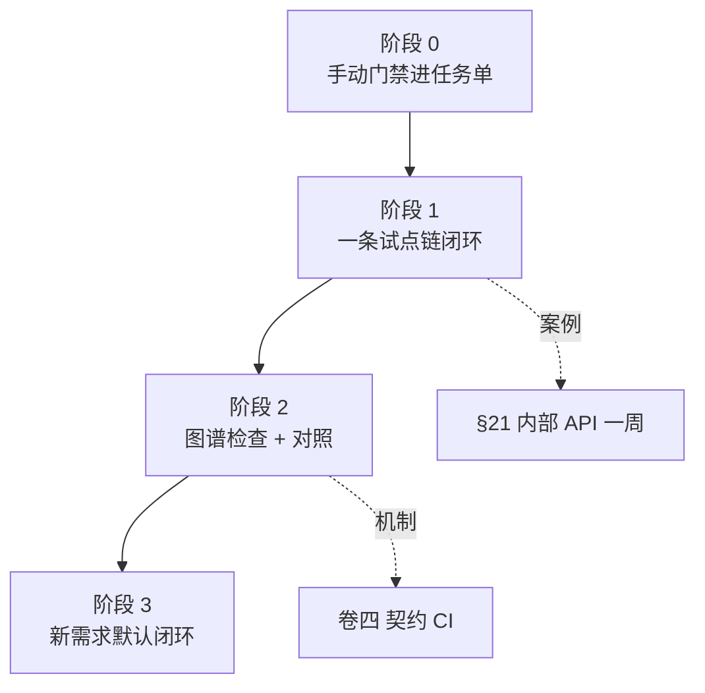


 #### 阶段 0：验得动（无 CI 也能开始）

**目标**：任何一轮合并前，都能说出 **「跑过哪些命令、谁勾了验收」**。


| 动作                    | 产出                                 |
| --------------------- | ---------------------------------- |
| 列出合并前命令               | 如 `pytest` 子集 + lint + build（按栈调整） |
| 写进 **任务单** 与仓库 README | 与卷三 §14.1「无 CI 降级」一致               |
| 无流水线时                 | PR 描述或自勾表 **拍照/存档**，当作 **手动门禁**    |


**时间**：通常 **1～2 天** 能定稿清单；不必等「先把 CI 搭完美」。

 #### 阶段 1：一条试点链 + 一轮闭环 + 示范性样板

**目标**：证明 **框架在存量仓能跑通一次**，并留下 **示范性样板**（供 Agent 模仿），而不是画满全仓图。


| 动作      | 说明                                                       |
| ------- | -------------------------------------------------------- |
| **选链**  | 优先 **内部工具 / 观测 / 配置类 API**；顺序：**内部 → 后台 → 登录 → 支付**（§21） |
| **任务单** | 验收、非范围、失败路径、测试策略、图谱入口                                    |
| **最小图** | 主图 1 张 + 分册 1 篇（70 分即可，卷二 §8.2）                          |
| **签收**  | CI 或手动全绿 + **书面落盘**（§23.5）                               |
| **示范性样板** | 将本轮 PR（代码 + 图 + 清单 + 任务单 + 签收）整理为 **可检索范例**；下一轮同类需求 **优先让 Agent 按此起草** |


**时间**：**约一周**（与 §21 周记同量级）；团队小可拆成两周，但 **范围勿扩** 成「顺便改五条链」。

 #### 阶段 2：图谱检查与对照（可选增强）

**目标**：把 **门牌号** 与代码绑紧，降低文档漂移。


| 动作                                 | 说明                                   |
| ---------------------------------- | ------------------------------------ |
| 契约/锚点清单 + PR 同改                    | 卷四 §17 主失败分支所演机制                     |
| export / 入口清单 + **叙述层** 检查接入 CI | 卷二 §9.5；**Agent 按示范性样板改图 + 人审**；示例后端仓库内已有同类操作指引（不对读者承诺路径） |
| 对照实验                               | 仅在 **声明题集 + 单仓** 内谈命中率/token（卷二 §9）  |


**诚实边界**：**不是**「上了检查就零维护」；日常改图以 **Agent 起草、人审** 为主（§23.6），人全手绘全仓 **不是** 目标态。

 #### 阶段 3：新需求默认闭环；老代码按需补图

**目标**：**新活** 走任务单 + 图谱入口 + 合并前检查；**老代码** 不追求一次铺满数字孪生。


| 动作    | 说明                          |
| ----- | --------------------------- |
| 新需求默认 | 任务单、失败路径、测试策略成习惯            |
| 老模块   | 仅在被这次改动波及时 **补分册**          |
| 不求全仓  | 卷二 §8.6：入口过多且无人维护时 **停止铺图** |


> ### **25.3 双轨并存：旧流程和新闭环共存多久？**

存量仓几乎总有 **「老需求仍走口头 + diff 瞄一眼」**。建议：


| 规则       | 说明                                         |
| -------- | ------------------------------------------ |
| **试点链**  | 明确命名（如「内部健康检查 API」），**只在这条链** 上强制任务单 + 门禁  |
| **扩链条件** | 同一链路 **连续 2 轮** 合并前检查全绿 + 签收 **无返工**，再选下一条 |
| **其它链路** | 仍可走旧路；**不要** 未试点就全仓强制 **任务单与验收字段**（卷三）           |


这样既不让团队窒息，也能让 **证据** 说话（「这条链确实更稳」）。

> ### **25.4 维护成本：稳态大概占多少工程时间？**


| 规模       | 估算参考（笔者实践口径，**非**承诺性 KPI）                    |
| -------- | ------------------------------------------- |
| **2～5 人**团队 | 稳态 **10%～15%** 用于 **试点链** 任务单、签收、清单/局部图与 occasional 对照（笔者示例仓约 3 名后端，**非** KPI） |
| **≤2 人**   | 目标 **≤10%**；过高则 **减项**                      |
| **>20%** | 减 **跨轮回顾摘要** 铺量、减子图扩张，或加强 **示范性样板 + Agent 改图** 与 CI 自动化 |


上述比例为 **稳态持续维护** 的增量工程时间，**不含** 第一条试点链建 **示范性样板** 的一次性投入（约一周，§21 / 阶段 1）。

**不是**「一次建好永久归零」，也 **不是**「全仓人手维护」的预算。若负责人把图谱当 **无人认领的文档坟场**，或 **无样板却强迫每条需求重画主图**，任何比例都会失控——需要 **Owner**（哪怕兼职）。

> ### **25.5 何时不要追求「全仓图谱」**

出现以下 **任一** 情况，宜 **暂停铺图**，只维护试点链：

- 对外入口 **>20** 且半年无人愿意改图；  
- 业务方明确 **不要** 工程地图，只要排期；  
- 链路已下线或极少调用，补图 **无消费者**；  
- 团队连阶段 0 都未做到（合并前命令都说不清）。

这与卷一 §5「纸上谈兵」边界一致：**先一条链跑通**，再谈推广。

> ### **25.6 全栈 / 双仓：前后端可以不同步阶段**


| 仓          | 建议                                        |
| ---------- | ----------------------------------------- |
| **后端 API** | 阶段 1 常先做（§21）                             |
| **前端 BFF** | 可 **并行另一条链**，或等契约类需求时做阶段 1（§22）           |
| **契约类需求**  | 任务单写清 **跨端非范围**；后端契约与 BFF 类型 **串行 PR** 更稳 |


范例栈为 **Python 后端 + Next.js BFF** 双仓，**不是** 单体 React 教程；合并前命令按 **分栈** 写（卷一 §6）。

> ### **25.7 阶段自检清单（可复制）**

```markdown
## 存量落地自检（当前阶段：0 / 1 / 2 / 3）

- [ ] 合并前命令已写入任务单且本轮跑过
- [ ] 试点链路已命名且非核心用户面
- [ ] 主图 + 至少一篇分册 / 或表格版入口清单
- [ ] 最近一轮有书面签收（含一人团队自勾表）
- [ ] （阶段 2+）契约/锚点检查与 PR 同改纪律已试过
- [ ] （阶段 3）新需求默认挂图谱入口
```

---

> ## **26. 结语（系列收束）**

五卷一条线：**在预算与模型不稳定的现实下，用「地图 + 交接单」把 AI 改动做成可验收的交付**。


| 卷      | 你带走的一句话                                |
| ------ | -------------------------------------- |
| **卷一** | 意图 / 成果 / 验收；图谱与协作流程 **叠放**            |
| **卷二** | 技术图谱：先看地图再动手                           |
| **卷三** | 任务单、书面签收、合并前必绿                         |
| **卷四** | 专题跑通、**收尾归档**；（可选）**跨轮回顾摘要** **少翻留痕**            |
| **卷五** | 存量 **先验得动、再一条链、再渐进**；**别外推** 成「两周全仓奇迹」 |


> ### **从哪里开始读**


| 你是谁             | 建议入口                           |
| --------------- | ------------------------------ |
| **新项目 / 愿意从零试** | 卷一 §6 最小起步 → 卷二 §8.2 第一份图      |
| **老项目 / 有历史包袱** | 本节卷五 §25 阶段 0 → §21 案例         |
| **全栈、契约常分叉**    | §22 + 卷四 §17                   |
| **读完卷三仍懵冷/温/热** | **§23.1** 对照表（**不改** 卷三已发正文）   |
| **想抄清单**        | 卷一 §6 模板 · 卷三 §11；**附册 B**（规划） |


> ### **系列之后**

- **附册**（术语、Blocking 模板、模型自检等）将 **另行连载**，**不** 占用卷六编号。  
- **方法论地图**（对外无卷号）计划在五卷定稿后单独发布，便于应聘 / 评审岗 **先读框架**（后续公开）。  
- 正文与连载稿：[GitHub · ai-coding-closed-loop-articles](https://github.com/Cyning12/ai-coding-closed-loop-articles)（卷一～四已发腾讯云；**本篇卷五** GitHub 已定稿，链见该仓 README）。

欢迎 Issue / 讨论与 fork；实践反馈会反哺 **附册与勘误**，卷三正文 **不因** 单条评论而改版。

---

---

*许可：CC BY 4.0 · 署名可转载与改编 · 系列文稿：[ai-coding-closed-loop-articles](https://github.com/Cyning12/ai-coding-closed-loop-articles)*

