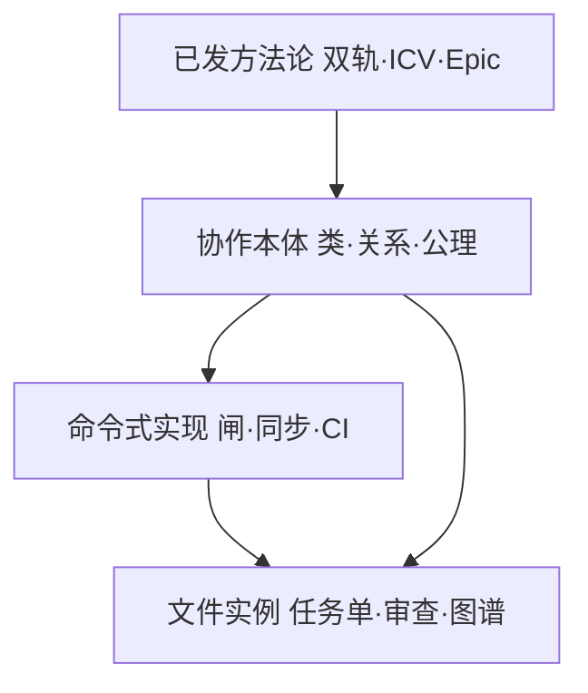
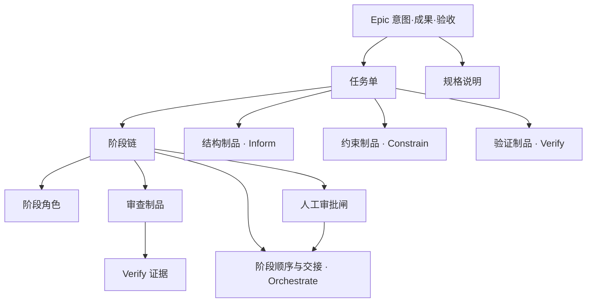

> **方法论地图之后——本体论如何表示 Epic、阶段与签收**  
> 系列《AI 编程可闭环协作》· **纪律包工程续篇 · 篇 1** · v1.0.0

## 目录


| 节   | 标题                     |
| --- | ---------------------- |
| 0   | 先读什么：阅读指针              |
| —   | 摘要                     |
| 1   | 方法论已经说了什么，还缺什么         |
| 2   | 本体论在本文中指什么（含与哲学本体论的关系） |
| 3   | OOP 与本体：两层语言，一种协作      |
| 4   | 核心类：把方法论里的「节点」命名清楚     |
| 5   | 关系与状态：阶段怎么连、能不能走       |
| 6   | 公理：把纪律写成可争论、可检查的约束     |
| 7   | 从 ICV 到 ICVO：编排为何值得单独讲 |
| 8   | 四支柱在本体里的落点             |
| 9   | 与 Agent 编排框架的分工        |
| 10  | 诚实边界与篇 2 预告            |
| 11  | 小结                     |


---

## 0. 先读什么：阅读指针

**本篇偏理论**，建议在 **叙事与操作** 打底后再读。

**建议阅读顺序**（**先叙事，再形式化**）


| 顺序 | 文档 |
| --- | --- |
| 1 | [方法论地图](https://cloud.tencent.com/developer/article/2681553) |
| 2 | [卷三](https://cloud.tencent.com/developer/article/2678669)（阶段流与签收 · **叙事与操作**） |
| 3 | **本篇**（协作本体的形式语义） |
| 4 | 篇 2：过程协作图（**待发**） |
| 按需 | [卷一](https://cloud.tencent.com/developer/article/2675471)～[卷五](https://cloud.tencent.com/developer/article/2681115) |


**图 · 方法论、本体与实现**



---

## 摘要

[方法论地图](https://cloud.tencent.com/developer/article/2681553) 用 **双轨**（过程轨 × 结构轨）和 **ICV 三支柱**（Inform · Constrain · Verify）讲清了 AI 协作的 **原则**：改哪里、敢不敢合、凭什么签收。卷三进一步给了 **阶段流**、**人工审批**、**任务单字段**——这些都是 **叙事与操作**。

本篇是 **理论续篇** 回答：**若要把这套方法论讲给别的团队、落到别的仓库、将来做机械检查**，需要一层 **形式语义**——用本体论里的 **类、关系、属性、公理** 把 Epic、阶段、审查、闸口 **表示出来**，并与 **命令式实现（OOP/脚本）** 分工，而不是用项目内部代号堆砌正文。

**一句话**：方法论告诉你 **协作应然**；本体论告诉你 **领域里有哪些东西、它们如何合法关联**；实现代码负责 **真的去拦、真的去同步**。

---

## 1. 方法论已经说了什么，还缺什么

### 1.1 地图与五卷已经建立的「节点」

读者若已跟过连载，脑中应已有这些 **协作节点**（名称来自已发正文，非本产品专有）：


| 节点          | 地图 / 卷里在说什么                                     |
| ----------- | ----------------------------------------------- |
| **Epic**    | 有边界的一轮交付：**意图、成果、验收** 三要素                       |
| **任务单**     | Epic 内的工单：背景、**非范围**、验收项、测试策略                   |
| **结构轨**     | 技术图谱：从哪进、影响谁、契约与入口一致                            |
| **过程轨**     | 谁做、何时人审、合并前检查是否全绿                               |
| **SDD 三支柱** | Inform（开工前读什么）· Constrain（边界与失败）· Verify（合并前证据） |
| **阶段流**     | 需求 → 审查 → 执行 → 自检 → 签收（卷三）                      |
| **书面签收**    | 审查结论 **落盘**；聊天不算本轮 **交付依据**                     |


这些节点在 **文章与流程图** 里是清楚的，但在 **跨团队迁移** 时容易变成「我们也有 task 单、也有 review」——却 **说不清** 与别人的 task、review **语义是否同构**。

### 1.2 叙事够用时，为何还要本体


| 只有叙事时         | 加一层本体后                                                      |
| ------------- | ----------------------------------------------------------- |
| 「审查过了才能改代码」   | **人工审批闸** 与 **执行阶段** 之间有一条 **阻塞关系**；闸为「待批」时，转移 **非法**       |
| 「任务单别被模板升级冲掉」 | **协作数据** 与 **可同步模板** 是不同 **类**；同步操作对前者 **禁止覆盖**             |
| 「这一棒谁负责」      | **阶段角色** 与 **下一棒** 是显式 **关系**，不是聊天里的口头指派                    |
| 「敢不敢合」        | **验收证据** 绑定在 **Verify** 制品上，与 **Orchestrate**（谁走到哪一步）**分表** |


本体论在这里 **不是** 哲学空谈，也 **不是** 必须上 OWL 推理机；它是给 **已发表方法论** 补一张 **概念关系图**：让 Tech Lead 能问「我们 Jira 上的 Story 对应你们本体里的哪一类？签收对应哪一类制品？」

### 1.3 与「只会写」的分工

**模型会写** 解决产出速度；**本趟敢合** 解决 **签收与证据**。Agent 编排框架多优化 **单次对话内的调用链**；方法论优化 **跨对话、跨人、跨合并** 的 **可复盘结构**。本体论服务的是后者。

---

## 2. 本体论在本文中指什么

### 2.0 与哲学中的本体论是什么关系

**有渊源，但不是搬哲学课本。**

哲学里的 **本体论（ontology）** 原指对「存在什么、以何种方式存在」的探究。20 世纪后半叶，这一思路进入 **知识工程** 与 **语义网**：用 **类、属性、关系、约束** 描述某一 **领域** 里有哪些概念、概念如何关联——例如医学本体、企业数据模型。软件工程里常见的 **领域模型**、**概念建模**、OWL/RDF 知识图谱，都属于这一脉的 **工程化**。

本文用的 **协作本体**，是这条脉络在 **「AI 辅助研发协作」** 上的 **领域化**：不讨论「存在本身」，而是把连载方法论里已有的 Epic、阶段、审查、闸口 **形式化** 为可共享的概念结构。因此：

| 哲学本体论 | 本文协作本体 |
| --- | --- |
| 追问「何物存在」 | 追问「协作领域里 **应承认哪些物件**」 |
| 抽象、跨具体项目 | 绑定已发方法论节点，但 **不绑定** 某一仓库目录名 |
| 可不落地 | 须能指导 **关系是否合法、状态能否转移** |

**不必** 为了读本文去学形而上学；把它当作 **给方法论补一张概念关系图** 即可。若你从未接触过 ontology 这个词，也 **不必先读哲学课本**——先读地图与卷三里的 **叙事与操作**，再读本篇 **形式化**（见 **§0**），顺序更顺。

若团队已习惯 UML 类图、领域驱动设计里的 **实体与聚合**，读起来会是 **同一类思维**，只是对象换成 **签收与阶段**，而非订单与库存。

### 2.1 定义（先定义，再用）

在软件工程语境下，本文的 **协作本体** 指：

> 对「AI 辅助研发协作」这一 **领域**，明确 **有哪些概念（类）**、**概念之间允许什么关系**、**哪些状态转移合法**、**哪些全局约束（公理）不可违反**。

它与 **技术图谱**（描述系统结构）**并列**：图谱回答「代码世界长什么样」；协作本体回答「协作世界里有哪些物件、怎么签收」。

### 2.2 本体 ≠ 又一个文档仓库


| 误区             | 澄清                                            |
| -------------- | --------------------------------------------- |
| 本体 = 多写几篇 Wiki | 本体强调 **类与关系的稳定命名**，Wiki 多是 **叙述**             |
| 本体 = 替代任务单     | **实例** 仍在任务单、审查正文里；本体规定 **这些实例属于哪类、缺什么就不合法**  |
| 本体 = 只有学者能读    | 好的协作本体应能让工程师说：「你们缺的是 **审查制品** 这一类，不是缺 Prompt」 |


### 2.3 与双轨的叠放

```text
结构轨  →  类：结构制品（图谱入口、契约、模块说明…）
过程轨  →  类：过程制品（任务单、审查、阶段记录、审批状态…）
SDD/ICV →  类上的「职责标签」：哪些类服务 Inform / Constrain / Verify / Orchestrate
```

双轨在地图里是 **正交落点**；在本体里是 **两类制品 + 它们如何被同一 Epic 引用**。

---

## 3. OOP 与本体：两层语言，一种协作

### 3.1 面向对象（OOP）擅长什么

安装脚本、同步工具、闸口检查、CI 任务——典型 **命令式 / OOP 实现**：读文件、复制模板、解析表格、返回成功或失败。它们必须 **跑得动**，像工地闸机。

OOP **擅长行为**，**不自动保证** 全团队对「任务单」「审查」 **语义一致**。两套团队各写一套脚本，可能都叫 `check()`，却 **拦的不是同一类违规**。

### 3.2 本体擅长什么

本体 **不替代** 脚本，而回答：

- **领域里有哪些类**（Epic、任务单、阶段、审查制品、审批闸…）  
- **实例之间什么关系合法**（一个 Epic 含多个任务单；审查 **必须** 对应某次审查阶段）  
- **什么转移非法**（闸未批准 → 不得进入执行阶段）  
- **什么操作禁止**（同步工具不得覆盖用户已写的任务单正文）

这是 **语义层**：跨 IDE、跨仓库、跨 Agent 品牌都能对齐 **「我们在谈同一类物件」**。

### 3.3 融合，非替代

```text
协作本体（类 · 关系 · 公理 · 状态机）  ← 方法论的形式化
        ↑ 约束
命令式实现（安装 · 同步 · 闸检查 · CI）  ← 必须服从本体约束
        ↑ 读写
文件实例（任务单 · 审查 · 图谱 · 配置）  ← 本轮交付依据的载体
```

**文件实例优先**：本体 **不主张** 用数据库覆盖任务单；它主张 **先说清楚文件里是什么类**，再 **可选** 从文件 **推导** 图或事件历史（篇 2 专讲）。

---

## 4. 核心类：把方法论里的「节点」命名清楚

下表把 **地图 / 卷三** 里的节点 **本体化**（公众可读名 · 非仓库路径）：


| 类（通俗名）    | 是什么                   | 方法论里对应什么                    |
| --------- | --------------------- | --------------------------- |
| **Epic**  | 有边界的一轮交付              | 意图 + 成果 + 验收                |
| **任务单**   | 可验收工单                 | 过程轨 Inform 入口之一             |
| **规格说明**  | 功能/Epic 级「要做什么」       | 先于或并行于任务单（功能轨）              |
| **阶段**    | 协作中的一个工位              | 需求、审查、执行、自检、复检、收尾…          |
| **阶段角色**  | 该阶段 Agent/人的 **行为边界** | 卷三「帽」的语义：不是 UI，是 **职责约束**   |
| **审查制品**  | 审查阶段的书面产出             | 零阻塞也须落盘                     |
| **人工审批闸** | 「须人批准才能继续」的状态         | 卷三人工闸                       |
| **自检结论**  | 执行者对验证命令的记录           | Verify 证据之一                 |
| **结构制品**  | 图谱、契约、入口说明            | 结构轨 Inform                  |
| **约束制品**  | 规范、编辑器规则              | Constrain                   |
| **验证制品**  | CI 配置、测试策略引用          | Verify                      |
| **执行环境**  | Cursor、Kimi Code 等    | **外置**；本体只 **引用**，不定义模型 API |


**关键区分**：

- **阶段** 管「流程走到哪」；**阶段角色** 管「这一棒按什么纪律说话」。  
- **审查制品** 管「审了什么」；**人工审批闸** 管「人是否放行」。二者常相邻，**不是** 同一类。  
- **Epic** 与 **任务单**：前者是 **一轮交付** 的边界；后者是其中的 **可执行单元**（卷四多任务时关系见第 5 节）。

---

## 5. 关系与状态：阶段怎么连、能不能走

### 5.1 主要关系（用自然语言，不用图数据库术语）


| 关系                  | 含义                   | 方法论出处           |
| ------------------- | -------------------- | --------------- |
| Epic **包含** 任务单     | 一轮交付可拆多张工单           | 卷四              |
| 任务单 **引用** 结构制品     | 改码前从哪张子图、哪个入口进       | 卷二 + 过程轨 Inform |
| 阶段 **产出** 审查制品      | 审查阶段结束应有书面记录         | 卷三              |
| 人工审批闸 **阻塞** 阶段     | 闸未批准时，被阻塞阶段 **不得开工** | 卷三              |
| 任务单 **声明** 验收项与测试策略 | Verify 的前置输入         | 地图 Epic 节       |
| 执行环境 **执行** 阶段角色    | 模型在壳里跑，纪律在阶段角色里      | 卷三              |


### 5.2 状态机（过程轨的心脏）

本体必须为 **任务单** 与 **审批闸** 定义 **合法状态**，否则「口头重来」无法被检查：

**任务单（示例）**：草稿 → 待审 → 进行中 →（阻塞 / 失败）→ 完成  

**审批闸（示例）**：待批 → 已批准 / 已拒绝  

**阻塞 / 失败分支（转移条件）**：

| 状态 | 典型触发 | 合法去向 |
| --- | --- | --- |
| **阻塞** | 审批闸待批、依赖未满足 | 停留在当前阶段，**不得** 进入执行 |
| **失败** | 执行或验证命令未通过 | 回到可再起草 / 再审查，或产出失败记录后再审 |
| **完成** | 验收项满足 + 签收与检查证据齐全 | Epic 内该任务单可声称收尾 |

**合法转移举例**：

- 审查 **拒绝** → 任务单应回到 **可再起草** 状态，而不是执行阶段悄悄继续。  
- **待批** 闸 → **执行阶段** 转移 **非法**（与卷三一致）。

状态机不是繁文缛节，而是 **让「敢不敢合」可形式化**：合并前问的不只是 CI，还有 **当前状态是否允许声称「做完了」**。

### 5.3 阶段链（卷三的叙事，本体的边）

功能/Epic 级（可省略于小修）：

```text
起草大纲 → 写规格 → 审规格 ↔ 规格签收闸
→ 起草任务单 → 写任务需求 → 审任务 ↔ 审查签收闸
→ 执行实现 ⇄ 自检（常同一执行者连续验证直至命令绿）
→ [独立复检] → 收尾
```

本体里这是一条 **有向阶段图**：节点是 **阶段**；边可带 **条件**（闸批准、测试策略满足）。**Orchestrate** 管的就是这张图的 **语义**，不是另发明一套 SDD。

---

## 6. 公理：把纪律写成可争论、可检查的约束

叙事里说「不要覆盖任务单」；本体里写成 **公理**，以便 **争论时对准同一条规则**，将来 **脚本可对照同一条规则拦截**。

### 6.1 三类公理（按职责，不背编号）


| 类型         | 在约束什么                | 方法论例子                               |
| ---------- | -------------------- | ----------------------------------- |
| **产品结构公理** | 协作框架 **不冒充** 业务运行时   | 纪律层 **不含** 业务代码、**不内置** LLM 调用      |
| **同步公理**   | 模板升级 **不得破坏** 用户协作数据 | 同步计划 **不得覆盖** 任务单与审查正文              |
| **过程公理**   | 阶段转移 **不得越闸**        | 审查闸待批时 **禁止** 进入执行；执行前 **必须** 经过闸检查 |


公理 **不是** 道德口号；它们应能回答：**若违反，哪一类转移或操作非法？**

### 6.2 从公理到机械检查（理论层）

实现层可以写脚本、CLI、CI step——本体 **只要求**：检查逻辑 **引用同一公理语义**。例如：

- 解析任务单上的审批表 → 判断执行阶段是否 **被阻塞**  
- 生成同步计划 → 判断是否 **触碰** 协作数据类路径

测的是 **敢不敢合** 的 **可重复性**，不是 LLM **会不会做题**（与做题型 benchmark **互补、不对标**）。篇 2 将说明：公理语义如何被 **过程图与事件历史** 引用、查询（本篇仍停留在理论层）。

### 6.3 开源协作场景的公理实例（无数字）

当过程轨与上游产品 **分轨**（例如 fork 开发、过程元数据走独立分支），本体可表达：**向上游提交的变更集** 与 **过程制品类** **不相交**。这是 **公理在场景上的实例**，不是新的方法论。

---

## 7. 从 ICV 到 ICVO：编排为何值得单独讲

### 7.1 地图里的「不发明第四支柱」仍成立

[方法论地图](https://cloud.tencent.com/developer/article/2681553) 明确：**ICV 三支柱归属 SDD**，不是第四套方法论。续篇引入 **Orchestrate（编排）** 作为 **ICVO 第四标签**，指的是：

> 在 **不改动 Inform / Constrain / Verify 的定义** 前提下，把卷三里原本落在「过程轨 + 阶段流」里的内容——**谁在第几棒、闸卡在哪、多任务如何收**——在 **形式语义里单独成类**，避免与 Verify **混表**。

### 7.2 为何容易与 Verify 混


| 若不分 Orchestrate     | 后果                      |
| ------------------- | ----------------------- |
| 「签了字」与「CI 绿了」混为一谈   | 不知道缺的是 **人审** 还是 **测试** |
| 「流程走到执行」与「证据齐全」混为一谈 | 执行已开始，但 **审查制品** 仍缺失    |
| Epic 多任务依赖说不清       | 只能堆 Jira 链接，**无类型**     |


**Orchestrate** 在本体里主要关联：**阶段、阶段角色、阶段顺序、审批闸、多任务依赖、交接记录**。  
**Verify** 主要关联：**验收项、测试策略、审查制品、自检结论、CI 结果**。

**一句话对照**：

| 支柱 | 核心问句 | 典型答案落在哪 |
| --- | --- | --- |
| **Orchestrate（编排）** | **谁在第几棒？闸卡住了吗？能进下一棒吗？** | 阶段顺序、审批闸、多任务依赖、交接 |
| **Verify（验证）** | **证据齐了吗？敢声称做完了吗？** | 验收项、测试策略、审查制品、自检、CI |

二者 **同轮协作、分表记账**：编排记录 **走到哪一步**；验证记录 **凭什么签字与合并**。

### 7.3 与方法论地图脚注的关系

地图 **v1.0.3** 脚注已将卷三阶段流 **显式命名为 Orchestrate**，与 ICV 合称 **ICVO**。  
**本文从理论展开**：脚注是 **读者入口**；本篇说明 **为何在形式语义里需要「编排」这一类**。分卷阅读顺序 **不变**。

---

## 8. 四支柱在本体里的落点

用 **「类 + 典型制品」** 对齐 ICVO（仍属 SDD，非新方法论）：


| 支柱              | 本体问题         | 典型类 / 制品                |
| --------------- | ------------ | ----------------------- |
| **Inform**      | 开工前 **依据什么** | 任务单、规格说明、结构制品、读序说明      |
| **Constrain**   | **边界与失败** 在哪 | 约束制品、非范围字段、失败路径、编辑器规则   |
| **Orchestrate** | **谁、何时、下一棒** | 阶段、阶段角色、审批闸、阶段图、多任务依赖   |
| **Verify**      | **凭什么声称做完**  | 验收项、测试策略、审查制品、自检结论、验证制品 |





**Guides（阶段角色模板）** 叠加在 ICV 之上：它们是 **阶段角色的可读实例**，不是 Inform 的定义来源。

---

## 9. 与 Agent 编排框架的分工


| 维度        | 协作本体 + 方法论           | LangChain 等 Agent 框架 |
| --------- | -------------------- | -------------------- |
| **核心问题**  | 协作 **语义** 与 **签收**   | 单次运行 **调用链**         |
| **一等对象**  | Epic、任务单、审查、闸        | Tool、Chain、Memory    |
| **持久化**   | 文件类 **过程制品**         | 常是会话或向量记忆            |
| **与 SDD** | 直接对齐 ICV/Orchestrate | 无内置 Epic 三要素         |
| **执行环境**  | **外置**、可替换           | 常绑定 provider         |


**不是替代关系**：多加一条 Chain **不自动** 产生 **审查制品** 与 **审批闸语义**；本体 **也不** 替你调用模型。二者 **叠加** 于同一仓库。

---

## 10. 诚实边界与篇 2 预告


| 项         | 说明                                                                   |
| --------- | -------------------------------------------------------------------- |
| **本篇**    | 协作 **本体论 + 方法论对齐**；偏理论，不展开工具安装步骤                                      |
| **未展开**   | 图谱物化、字段级任务单模板、CI 步骤名 — 见卷二～三                                         |
| **篇 2**   | 当文件实例足够时，**可选** 从协作本体 **投影** 为过程图与事件历史（显式边、不可变事件、公理查询）— **不替代** 文件优先 |
| **旧实验数字** | 个人测试项目小样本指标 **不复述**、不外推                                              |


本体 **不承诺** 预测 Agent 行为或替代 Code Review 的判断力；它承诺 **判断所依据的物件与关系可以讲清、可以查、将来可以机械对照**。

---

## 11. 小结

**四句话带走：**

1. **方法论** 给出双轨、ICV、Epic、阶段流；**本体** 把这些节点 **类化**，并规定 **关系与合法转移**。
2. **OOP/脚本** 实现 **拦、同步、跑 CI**；**本体** 规定 **拦的是什么语义**。
3. **Orchestrate** 不是第四套方法论，而是 **阶段与闸** 在形式语义里的 **单独标签**，与 Verify **分表**。
4. **文件实例** 仍是本轮 **交付依据**；图与事件是 **可选增强**（篇 2）。前置阅读见 **§0**。

---

*许可：CC BY 4.0 · 署名可转载与改编 · 系列文稿：[ai-coding-closed-loop-articles](https://github.com/Cyning12/ai-coding-closed-loop-articles)*
